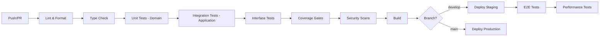

# 5.b Test Plans & QA Strategies

Created by: Abe Caymo
Created time: February 18, 2025 4:31 PM
Category: Engineering, Strategy doc
Last edited by: Document Review Panel
Last updated time: January 15, 2026

# **Testing Practices & Strategies**

*Outsourcing Digital Agency – Integrated Internal Systems Ecosystem*

*v2.0.0 – [January 15, 2026]*

*Aligned with: Coding Guidelines v3.0.0, TSD v3.0.0, FRD v2.0.0*

---

## **1. Introduction**

### 1.1 Purpose
This document outlines the official testing methodologies, management processes, and quality metrics for the Integrated Internal Systems Ecosystem. The goal is to ensure a high-quality, reliable, secure, and performant application through a structured and collaborative testing approach that aligns with our functional architecture principles.

### 1.2 Scope
These strategies apply to all code and infrastructure changes across all modules of the project, following the Domain-Driven Design modular structure:
- `src/modules/*/domain/` - Pure business logic
- `src/modules/*/application/` - Service orchestration
- `src/modules/*/infrastructure/` - External integrations
- `src/modules/*/interface/` - API routes and UI components

### 1.3 Audience
This document is intended for all Developers and Quality Assurance (QA) Engineers involved in the project.

### 1.4 Related Documents
- **Coding Guidelines v3.0.0** - Testing patterns and coverage requirements
- **TSD v3.0.0** - Technical specifications and API contracts
- **FRD v2.0.0** - Functional requirements with acceptance criteria

---

## **2. Testing Philosophy**

### 2.1 Functional Core, Imperative Shell
Our testing strategy follows the architectural principle of separating pure logic from side effects:

| Layer | Purity | Testing Focus | Coverage Target |
|-------|--------|---------------|-----------------|
| Domain | Pure functions | Input/output correctness, edge cases | **100%** |
| Application | Orchestration | Service composition, dependency injection | **80%** |
| Interface | Side effects | API contracts, UI behavior | **60%** |

### 2.2 Parse, Don't Validate (Zero Trust)
All external inputs must be validated at system boundaries using Zod schemas. Tests must verify:
- Valid inputs produce expected outputs
- Invalid inputs are rejected before reaching domain logic
- Error responses conform to RFC 7807 Problem Details

### 2.3 Result Type Testing
All domain and application functions return `Result<T, E>` types. Tests must assert on:
- `result.success` (boolean) - not `result.ok`
- `result.data` for success cases
- `result.error._tag` for failure cases (tagged union discrimination)

---

## **3. Testing Methodologies & Scope**

A multi-layered testing approach ensures comprehensive coverage aligned with the architectural layers.

### 3.1 Unit Testing (Domain Layer)

- **Description:** Testing of pure functions in the domain layer in complete isolation. No mocks required for pure functions.
- **Tools:** Vitest 3.x
- **Responsibility:** Developers
- **Coverage:** **100% required**
- **Scope:**
  - `src/modules/*/domain/` - Business logic, calculations, validations
  - `src/lib/functional/` - Utility functions
  - Zod schema validation logic

```typescript
// src/modules/candidate-management/tests/domain/candidate.test.ts
import { describe, it, expect } from 'vitest';
import { validateCandidateStatus, calculateExperience } from '../../domain/candidate';
import { CandidateStatusSchema } from '../../domain/validations';

describe('Candidate Domain Logic', () => {
  describe('validateCandidateStatus', () => {
    it('should accept valid status transitions', () => {
      const result = validateCandidateStatus('new', 'screening');

      expect(result.success).toBe(true);
      if (result.success) {
        expect(result.data).toBe('screening');
      }
    });

    it('should reject invalid status transitions', () => {
      const result = validateCandidateStatus('new', 'hired');

      expect(result.success).toBe(false);
      if (!result.success) {
        expect(result.error._tag).toBe('InvalidStatusTransition');
      }
    });
  });

  describe('Zod Schema Validation', () => {
    it('should validate email format', () => {
      const result = CandidateStatusSchema.safeParse('invalid-status');

      expect(result.success).toBe(false);
    });

    it('should accept valid status values', () => {
      const result = CandidateStatusSchema.safeParse('screening');

      expect(result.success).toBe(true);
    });
  });
});
```

### 3.2 Integration Testing (Application Layer)

- **Description:** Testing service orchestration with mocked dependencies using the ReaderResult pattern. Verifies that application services correctly compose domain logic with infrastructure.
- **Tools:** Vitest 3.x
- **Responsibility:** Developers
- **Coverage:** **80% required**
- **Scope:** `src/modules/*/application/` - Service composition, event publishing

```typescript
// src/modules/candidate-management/tests/application/candidate-service.test.ts
import { describe, it, expect, vi, beforeEach } from 'vitest';
import { createCandidate, updateCandidateStatus } from '../../application/candidate-service';
import type { CandidateDeps } from '../../application/types';

describe('CandidateService', () => {
  // create mock dependencies for ReaderResult pattern
  const createMockDeps = (): CandidateDeps => ({
    candidateRepository: {
      findById: vi.fn(),
      save: vi.fn(),
      findByEmail: vi.fn(),
    },
    eventPublisher: {
      publish: vi.fn(),
    },
    logger: {
      info: vi.fn(),
      error: vi.fn(),
      warn: vi.fn(),
      debug: vi.fn(),
    },
  });

  describe('createCandidate', () => {
    it('should create candidate and publish event on success', async () => {
      const mockDeps = createMockDeps();
      mockDeps.candidateRepository.findByEmail.mockResolvedValue(null);
      mockDeps.candidateRepository.save.mockResolvedValue({
        id: '01910c29-8a3d-7e0e-9e3a-1234567890ab',
        name: 'Jane Doe',
        email: 'jane@example.com',
        status: 'new',
      });
      mockDeps.eventPublisher.publish.mockResolvedValue(undefined);

      const result = await createCandidate({
        name: 'Jane Doe',
        email: 'jane@example.com',
      })(mockDeps);

      expect(result.success).toBe(true);
      if (result.success) {
        expect(result.data.id).toBeDefined();
        expect(result.data.status).toBe('new');
      }
      expect(mockDeps.eventPublisher.publish).toHaveBeenCalledWith(
        'candidate.created',
        expect.objectContaining({ email: 'jane@example.com' })
      );
    });

    it('should return error for duplicate email', async () => {
      const mockDeps = createMockDeps();
      mockDeps.candidateRepository.findByEmail.mockResolvedValue({
        id: 'existing-id',
        email: 'jane@example.com',
      });

      const result = await createCandidate({
        name: 'Jane Doe',
        email: 'jane@example.com',
      })(mockDeps);

      expect(result.success).toBe(false);
      if (!result.success) {
        expect(result.error._tag).toBe('DuplicateEmailError');
      }
      expect(mockDeps.candidateRepository.save).not.toHaveBeenCalled();
    });

    it('should handle persistence errors gracefully', async () => {
      const mockDeps = createMockDeps();
      mockDeps.candidateRepository.findByEmail.mockResolvedValue(null);
      mockDeps.candidateRepository.save.mockRejectedValue(new Error('DB connection failed'));

      const result = await createCandidate({
        name: 'Jane Doe',
        email: 'jane@example.com',
      })(mockDeps);

      expect(result.success).toBe(false);
      if (!result.success) {
        expect(result.error._tag).toBe('PersistenceError');
        expect(result.error.operation).toBe('save');
      }
    });
  });
});
```

### 3.3 Interface Testing (API & UI)

- **Description:** Testing API routes and UI components for correct request/response handling and RFC 7807 compliance.
- **Tools:** Vitest 3.x (API), Playwright Component Testing (UI)
- **Responsibility:** Developers
- **Coverage:** **60% required**
- **Scope:** `src/modules/*/interface/` - API routes, React components

```typescript
// src/modules/candidate-management/tests/interface/api.test.ts
import { describe, it, expect, vi } from 'vitest';
import { POST } from '../../interface/api/candidates/route';
import { NextRequest } from 'next/server';

describe('Candidate API Routes', () => {
  describe('POST /api/candidates', () => {
    it('should return 201 with candidate data on success', async () => {
      const request = new NextRequest('http://localhost/api/candidates', {
        method: 'POST',
        body: JSON.stringify({ name: 'Jane Doe', email: 'jane@example.com' }),
      });

      const response = await POST(request);
      const data = await response.json();

      expect(response.status).toBe(201);
      expect(data.id).toBeDefined();
    });

    it('should return RFC 7807 Problem Details on validation error', async () => {
      const request = new NextRequest('http://localhost/api/candidates', {
        method: 'POST',
        body: JSON.stringify({ name: '', email: 'invalid-email' }),
      });

      const response = await POST(request);
      const problem = await response.json();

      expect(response.status).toBe(400);
      expect(response.headers.get('Content-Type')).toBe('application/problem+json');

      // RFC 7807 compliance assertions
      expect(problem.type).toMatch(/\/errors\/validation-error$/);
      expect(problem.title).toBe('Validation Error');
      expect(problem.status).toBe(400);
      expect(problem.errors).toBeInstanceOf(Array);
      expect(problem.errors).toContainEqual(
        expect.objectContaining({ field: 'email' })
      );
    });

    it('should return RFC 7807 Problem Details on not found', async () => {
      const request = new NextRequest('http://localhost/api/candidates/nonexistent', {
        method: 'GET',
      });

      const response = await GET(request, { params: { id: 'nonexistent' } });
      const problem = await response.json();

      expect(response.status).toBe(404);
      expect(problem.type).toMatch(/\/errors\/not-found$/);
      expect(problem.title).toBe('Resource Not Found');
    });
  });
});
```

### 3.4 End-to-End (E2E) Testing

- **Description:** Simulates complete user workflows from the user interface (UI) to the database and back. These tests validate the system from a user's perspective.
- **Tools:** Playwright 1.45+
- **Responsibility:** QA Engineers
- **Scope:** Critical user flows such as candidate onboarding, status transitions, and search functionality.

### 3.5 Performance Testing

- **Description:** Measures the responsiveness, stability, and scalability of the application under various load conditions.
- **Tools:** k6 (for load testing APIs), Lighthouse CI (for frontend performance analysis)
- **Responsibility:** QA Engineers, with support from Developers
- **Scope:**
  - API response time and throughput testing
  - Frontend Core Web Vitals (LCP, FID, CLS)
  - Database query performance under load

### 3.6 Security Testing

- **Description:** A comprehensive security testing strategy covering static analysis, dynamic testing, and supply chain security.
- **Tools:** See Section 9 for detailed tooling
- **Responsibility:** QA Engineers & Security Lead
- **Scope:**
  - Static Application Security Testing (SAST)
  - Dynamic Application Security Testing (DAST)
  - Software Composition Analysis (SCA)
  - Secrets scanning
  - Zero Trust control validation

### 3.7 Regression Testing

- **Description:** A suite of automated E2E and critical integration tests that are run before every release to ensure that new changes have not adversely affected existing functionality.
- **Tools:** Playwright
- **Responsibility:** QA Engineers (automation), with all team members participating in manual regression checks if needed.

---

## **4. Vitest 3.x Patterns & Best Practices**

### 4.1 Modern Mocking with vi.hoisted()

**Critical:** `vi.mock()` calls are hoisted to the top of the file. Use `vi.hoisted()` for mock state that needs to be defined before hoisting.

```typescript
// ❌ BAD - This will fail (mock variable undefined during hoist)
import { db } from '@/lib/db';
const mockDb = { query: vi.fn() };
vi.mock('@/lib/db', () => ({ db: mockDb })); // mockDb is undefined!

// ✅ GOOD - Use vi.hoisted() for mock state
import { db } from '@/lib/db';

const { mockQuery } = vi.hoisted(() => ({
  mockQuery: vi.fn(),
}));

vi.mock('@/lib/db', () => ({
  db: { query: mockQuery },
}));

describe('CandidateRepository', () => {
  beforeEach(() => {
    mockQuery.mockReset();
  });

  it('should query candidates', async () => {
    mockQuery.mockResolvedValue([{ id: '1', name: 'Jane' }]);
    // ...test logic
  });
});
```

### 4.2 Test Fixtures with test.extend()

Use `test.extend()` to create reusable test fixtures for common setup patterns.

```typescript
// src/test/fixtures/candidate.fixture.ts
import { test as base } from 'vitest';
import type { CandidateDeps } from '@/modules/candidate-management/application/types';

interface CandidateFixtures {
  mockDeps: CandidateDeps;
  sampleCandidate: { id: string; name: string; email: string };
}

export const test = base.extend<CandidateFixtures>({
  mockDeps: async ({}, use) => {
    const deps: CandidateDeps = {
      candidateRepository: {
        findById: vi.fn(),
        save: vi.fn(),
        findByEmail: vi.fn(),
      },
      eventPublisher: { publish: vi.fn() },
      logger: { info: vi.fn(), error: vi.fn(), warn: vi.fn(), debug: vi.fn() },
    };
    await use(deps);
  },
  sampleCandidate: async ({}, use) => {
    await use({
      id: '01910c29-8a3d-7e0e-9e3a-1234567890ab',
      name: 'Jane Doe',
      email: 'jane@example.com',
    });
  },
});

// usage in tests
import { test } from '@/test/fixtures/candidate.fixture';

test('should create candidate', async ({ mockDeps, sampleCandidate }) => {
  mockDeps.candidateRepository.save.mockResolvedValue(sampleCandidate);
  // ...test logic
});
```

### 4.3 Testing Zod Schemas

All Zod schemas require comprehensive testing at the domain layer.

```typescript
// src/modules/candidate-management/tests/domain/validations.test.ts
import { describe, it, expect } from 'vitest';
import {
  CandidateSchema,
  CandidateCreateSchema,
  CandidateStatusSchema
} from '../../domain/validations';

describe('Candidate Validation Schemas', () => {
  describe('CandidateCreateSchema', () => {
    it('should accept valid candidate data', () => {
      const result = CandidateCreateSchema.safeParse({
        name: 'Jane Doe',
        email: 'jane@example.com',
        phone: '+1234567890',
      });

      expect(result.success).toBe(true);
    });

    it('should reject empty name', () => {
      const result = CandidateCreateSchema.safeParse({
        name: '',
        email: 'jane@example.com',
      });

      expect(result.success).toBe(false);
      if (!result.success) {
        expect(result.error.issues[0].path).toContain('name');
      }
    });

    it('should reject invalid email format', () => {
      const result = CandidateCreateSchema.safeParse({
        name: 'Jane Doe',
        email: 'not-an-email',
      });

      expect(result.success).toBe(false);
      if (!result.success) {
        expect(result.error.issues[0].path).toContain('email');
        expect(result.error.issues[0].code).toBe('invalid_string');
      }
    });

    it('should handle refinement edge cases', () => {
      // test custom refinements like name length limits
      const result = CandidateCreateSchema.safeParse({
        name: 'A'.repeat(256), // exceeds max length
        email: 'jane@example.com',
      });

      expect(result.success).toBe(false);
    });
  });

  describe('CandidateStatusSchema', () => {
    const validStatuses = ['new', 'screening', 'interview', 'offer', 'hired', 'rejected'];

    it.each(validStatuses)('should accept valid status: %s', (status) => {
      const result = CandidateStatusSchema.safeParse(status);
      expect(result.success).toBe(true);
    });

    it('should reject invalid status', () => {
      const result = CandidateStatusSchema.safeParse('invalid-status');
      expect(result.success).toBe(false);
    });
  });
});
```

### 4.4 Testing Result Types

Test both success and error branches of Result-returning functions.

```typescript
// src/modules/candidate-management/tests/application/result-patterns.test.ts
import { describe, it, expect } from 'vitest';
import { Result } from '@/lib/functional/result';
import { processCandidate } from '../../application/candidate-processor';

describe('Result Type Testing Patterns', () => {
  describe('Success Cases', () => {
    it('should return success result with data', async () => {
      const result = await processCandidate(validInput)(mockDeps);

      // always check success first
      expect(result.success).toBe(true);

      // type narrowing after success check
      if (result.success) {
        expect(result.data.id).toBeDefined();
        expect(result.data.status).toBe('processed');
      }
    });
  });

  describe('Error Cases', () => {
    it('should return tagged error for validation failures', async () => {
      const result = await processCandidate(invalidInput)(mockDeps);

      expect(result.success).toBe(false);

      if (!result.success) {
        // discriminate on _tag for specific error handling
        expect(result.error._tag).toBe('ZodValidationError');
        expect(result.error.cause.issues).toBeDefined();
      }
    });

    it('should return tagged error for persistence failures', async () => {
      mockDeps.repository.save.mockRejectedValue(new Error('DB Error'));

      const result = await processCandidate(validInput)(mockDeps);

      expect(result.success).toBe(false);

      if (!result.success) {
        expect(result.error._tag).toBe('PersistenceError');
        expect(result.error.operation).toBe('save');
        expect(result.error.cause).toBeInstanceOf(Error);
      }
    });
  });

  describe('Table-Driven Tests', () => {
    const testCases = [
      { input: { name: 'Valid', email: 'v@e.com' }, expectedSuccess: true },
      { input: { name: '', email: 'v@e.com' }, expectedSuccess: false, expectedTag: 'ZodValidationError' },
      { input: { name: 'Valid', email: 'bad' }, expectedSuccess: false, expectedTag: 'ZodValidationError' },
    ];

    it.each(testCases)(
      'should handle input: $input.name / $input.email',
      async ({ input, expectedSuccess, expectedTag }) => {
        const result = await processCandidate(input)(mockDeps);

        expect(result.success).toBe(expectedSuccess);
        if (!expectedSuccess && expectedTag && !result.success) {
          expect(result.error._tag).toBe(expectedTag);
        }
      }
    );
  });
});
```

### 4.5 Testing ReaderResult Composition

Test service composition with the ReaderResult pattern.

```typescript
// src/modules/candidate-management/tests/application/composition.test.ts
import { describe, it, expect, vi } from 'vitest';
import { pipe } from '@/lib/functional/composition';
import {
  findCandidate,
  updateStatus,
  publishEvent
} from '../../application/candidate-operations';

describe('ReaderResult Composition', () => {
  const mockDeps = createMockDeps();

  it('should compose operations and propagate success', async () => {
    mockDeps.repository.findById.mockResolvedValue({ id: '1', status: 'new' });
    mockDeps.repository.save.mockResolvedValue({ id: '1', status: 'screening' });
    mockDeps.eventPublisher.publish.mockResolvedValue(undefined);

    const workflow = pipe(
      findCandidate('1'),
      ReaderResult.flatMap(updateStatus('screening')),
      ReaderResult.tap(publishEvent('candidate.status.changed'))
    );

    const result = await workflow(mockDeps);

    expect(result.success).toBe(true);
    expect(mockDeps.eventPublisher.publish).toHaveBeenCalledWith(
      'candidate.status.changed',
      expect.objectContaining({ status: 'screening' })
    );
  });

  it('should short-circuit on first error', async () => {
    mockDeps.repository.findById.mockResolvedValue(null); // not found

    const workflow = pipe(
      findCandidate('nonexistent'),
      ReaderResult.flatMap(updateStatus('screening')),
      ReaderResult.tap(publishEvent('candidate.status.changed'))
    );

    const result = await workflow(mockDeps);

    expect(result.success).toBe(false);
    if (!result.success) {
      expect(result.error._tag).toBe('NotFoundError');
    }
    // subsequent operations should not be called
    expect(mockDeps.repository.save).not.toHaveBeenCalled();
    expect(mockDeps.eventPublisher.publish).not.toHaveBeenCalled();
  });
});
```

---

## **5. Playwright Patterns & Best Practices**

### 5.1 Page Object Model

Encapsulate page interactions for maintainable E2E tests.

```typescript
// tests/pages/candidates.page.ts
import { Page, Locator } from '@playwright/test';

export class CandidatesPage {
  readonly page: Page;
  readonly addButton: Locator;
  readonly nameInput: Locator;
  readonly emailInput: Locator;
  readonly submitButton: Locator;
  readonly successToast: Locator;
  readonly errorToast: Locator;

  constructor(page: Page) {
    this.page = page;
    this.addButton = page.getByTestId('add-candidate-btn');
    this.nameInput = page.getByTestId('candidate-name');
    this.emailInput = page.getByTestId('candidate-email');
    this.submitButton = page.getByTestId('submit-btn');
    this.successToast = page.getByTestId('success-toast');
    this.errorToast = page.getByTestId('error-toast');
  }

  async navigateTo() {
    await this.page.goto('/candidates');
    await this.page.waitForLoadState('networkidle');
  }

  async createCandidate(data: { name: string; email: string }) {
    await this.addButton.click();
    await this.nameInput.fill(data.name);
    await this.emailInput.fill(data.email);
    await this.submitButton.click();
  }

  async waitForSuccess() {
    await this.successToast.waitFor({ state: 'visible' });
  }

  async waitForError() {
    await this.errorToast.waitFor({ state: 'visible' });
  }
}
```

### 5.2 Component Testing

Use Playwright Component Testing for isolated UI component tests without full E2E overhead.

```typescript
// tests/components/candidate-form.spec.tsx
import { test, expect } from '@playwright/experimental-ct-react';
import { CandidateForm } from '@/modules/candidate-management/interface/components/CandidateForm';

test.describe('CandidateForm Component', () => {
  test('should render form fields', async ({ mount }) => {
    const component = await mount(<CandidateForm onSubmit={() => {}} />);

    await expect(component.getByLabel('Name')).toBeVisible();
    await expect(component.getByLabel('Email')).toBeVisible();
    await expect(component.getByRole('button', { name: 'Submit' })).toBeVisible();
  });

  test('should show validation errors on invalid input', async ({ mount }) => {
    const component = await mount(<CandidateForm onSubmit={() => {}} />);

    await component.getByRole('button', { name: 'Submit' }).click();

    await expect(component.getByText('Name is required')).toBeVisible();
    await expect(component.getByText('Invalid email')).toBeVisible();
  });

  test('should call onSubmit with valid data', async ({ mount }) => {
    let submittedData: unknown = null;
    const component = await mount(
      <CandidateForm onSubmit={(data) => { submittedData = data; }} />
    );

    await component.getByLabel('Name').fill('Jane Doe');
    await component.getByLabel('Email').fill('jane@example.com');
    await component.getByRole('button', { name: 'Submit' }).click();

    expect(submittedData).toEqual({
      name: 'Jane Doe',
      email: 'jane@example.com',
    });
  });
});
```

### 5.3 API Mocking

Use `page.route()` to mock API responses for reliable, fast E2E tests.

```typescript
// tests/e2e/candidates.spec.ts
import { test, expect } from '@playwright/test';
import { CandidatesPage } from '../pages/candidates.page';

test.describe('Candidate Management E2E', () => {
  test('should display candidates from API', async ({ page }) => {
    // mock the API response
    await page.route('**/api/candidates', async (route) => {
      await route.fulfill({
        status: 200,
        contentType: 'application/json',
        body: JSON.stringify([
          { id: '1', name: 'Jane Doe', email: 'jane@example.com', status: 'new' },
          { id: '2', name: 'John Smith', email: 'john@example.com', status: 'screening' },
        ]),
      });
    });

    const candidatesPage = new CandidatesPage(page);
    await candidatesPage.navigateTo();

    await expect(page.getByText('Jane Doe')).toBeVisible();
    await expect(page.getByText('John Smith')).toBeVisible();
  });

  test('should handle API errors gracefully', async ({ page }) => {
    // mock an error response with RFC 7807 format
    await page.route('**/api/candidates', async (route) => {
      await route.fulfill({
        status: 500,
        contentType: 'application/problem+json',
        body: JSON.stringify({
          type: 'https://api.aptivo.com/errors/internal-error',
          title: 'Internal Server Error',
          status: 500,
          detail: 'Database connection failed',
        }),
      });
    });

    const candidatesPage = new CandidatesPage(page);
    await candidatesPage.navigateTo();

    await expect(page.getByText('Something went wrong')).toBeVisible();
  });

  test('should create candidate successfully', async ({ page }) => {
    // mock POST endpoint
    await page.route('**/api/candidates', async (route) => {
      if (route.request().method() === 'POST') {
        await route.fulfill({
          status: 201,
          contentType: 'application/json',
          body: JSON.stringify({
            id: '3',
            name: 'New Candidate',
            email: 'new@example.com',
            status: 'new',
          }),
        });
      } else {
        await route.continue();
      }
    });

    const candidatesPage = new CandidatesPage(page);
    await candidatesPage.navigateTo();
    await candidatesPage.createCandidate({
      name: 'New Candidate',
      email: 'new@example.com',
    });

    await candidatesPage.waitForSuccess();
  });
});
```

### 5.4 Accessibility Testing

Integrate accessibility audits into E2E tests.

```typescript
// tests/e2e/accessibility.spec.ts
import { test, expect } from '@playwright/test';
import AxeBuilder from '@axe-core/playwright';

test.describe('Accessibility Audits', () => {
  test('candidates page should have no accessibility violations', async ({ page }) => {
    await page.goto('/candidates');
    await page.waitForLoadState('networkidle');

    const accessibilityScanResults = await new AxeBuilder({ page })
      .withTags(['wcag2a', 'wcag2aa', 'wcag21aa'])
      .analyze();

    expect(accessibilityScanResults.violations).toEqual([]);
  });

  test('candidate form should be keyboard navigable', async ({ page }) => {
    await page.goto('/candidates/new');

    // tab through form elements
    await page.keyboard.press('Tab');
    await expect(page.getByLabel('Name')).toBeFocused();

    await page.keyboard.press('Tab');
    await expect(page.getByLabel('Email')).toBeFocused();

    await page.keyboard.press('Tab');
    await expect(page.getByRole('button', { name: 'Submit' })).toBeFocused();
  });
});
```

### 5.5 Visual Regression Testing

Capture and compare screenshots for visual consistency.

```typescript
// tests/e2e/visual.spec.ts
import { test, expect } from '@playwright/test';

test.describe('Visual Regression', () => {
  test('candidates list should match snapshot', async ({ page }) => {
    await page.goto('/candidates');
    await page.waitForLoadState('networkidle');

    await expect(page).toHaveScreenshot('candidates-list.png', {
      maxDiffPixels: 100,
    });
  });

  test('empty state should match snapshot', async ({ page }) => {
    await page.route('**/api/candidates', async (route) => {
      await route.fulfill({
        status: 200,
        body: JSON.stringify([]),
      });
    });

    await page.goto('/candidates');

    await expect(page).toHaveScreenshot('candidates-empty.png');
  });
});
```

---

## **6. Testing RFC 7807 Error Responses**

All API error responses must conform to RFC 7807 Problem Details format. This section provides testing patterns for compliance.

### 6.1 Problem Details Schema Validation

```typescript
// src/test/utils/problem-details.ts
import { z } from 'zod';

export const ProblemDetailsSchema = z.object({
  type: z.string().url(),
  title: z.string(),
  status: z.number().int().min(400).max(599),
  detail: z.string().optional(),
  instance: z.string().optional(),
  traceId: z.string().optional(),
  errors: z.array(z.object({
    field: z.string(),
    message: z.string(),
    code: z.string().optional(),
  })).optional(),
});

export type ProblemDetails = z.infer<typeof ProblemDetailsSchema>;

export function assertProblemDetails(response: unknown): asserts response is ProblemDetails {
  const result = ProblemDetailsSchema.safeParse(response);
  if (!result.success) {
    throw new Error(`Invalid Problem Details format: ${result.error.message}`);
  }
}
```

### 6.2 API Error Response Testing

```typescript
// src/modules/candidate-management/tests/interface/error-responses.test.ts
import { describe, it, expect } from 'vitest';
import { assertProblemDetails } from '@/test/utils/problem-details';

describe('RFC 7807 Compliance', () => {
  const ERROR_TYPE_BASE = 'https://api.aptivo.com/errors';

  describe('Validation Errors (400)', () => {
    it('should return valid Problem Details for validation errors', async () => {
      const response = await fetch('/api/candidates', {
        method: 'POST',
        body: JSON.stringify({ name: '', email: 'invalid' }),
      });
      const body = await response.json();

      expect(response.status).toBe(400);
      expect(response.headers.get('Content-Type')).toBe('application/problem+json');

      assertProblemDetails(body);
      expect(body.type).toBe(`${ERROR_TYPE_BASE}/validation-error`);
      expect(body.title).toBe('Validation Error');
      expect(body.status).toBe(400);
      expect(body.errors).toBeDefined();
      expect(body.errors!.length).toBeGreaterThan(0);
    });
  });

  describe('Not Found Errors (404)', () => {
    it('should return valid Problem Details for not found', async () => {
      const response = await fetch('/api/candidates/nonexistent');
      const body = await response.json();

      expect(response.status).toBe(404);
      assertProblemDetails(body);
      expect(body.type).toBe(`${ERROR_TYPE_BASE}/not-found`);
      expect(body.title).toBe('Resource Not Found');
    });
  });

  describe('Server Errors (500)', () => {
    it('should return valid Problem Details without exposing internals', async () => {
      // trigger a server error (mock or test scenario)
      const response = await fetch('/api/test/trigger-error');
      const body = await response.json();

      expect(response.status).toBe(500);
      assertProblemDetails(body);
      expect(body.type).toBe(`${ERROR_TYPE_BASE}/internal-error`);
      expect(body.detail).not.toContain('stack');
      expect(body.detail).not.toContain('password');
    });
  });
});
```

---

## **7. CI/CD Pipeline**

Our Continuous Integration and Continuous Deployment pipeline is orchestrated via GitHub Actions and ensures that every change is automatically tested before being deployed.

### 7.1 Pipeline Stages



### 7.2 Automated Checks

1. **Lint & Format:** Code is checked against ESLint flat config and Prettier rules.
2. **Type Check:** TypeScript strict mode compilation with no errors.
3. **Unit Tests:** Domain layer tests with **100% coverage gate**.
4. **Integration Tests:** Application layer tests with **80% coverage gate**.
5. **Interface Tests:** API and UI tests with **60% coverage gate**.
6. **Security Scans:** SAST, SCA, and secrets scanning (see Section 9).
7. **Build:** Production build must succeed.

### 7.3 Tiered Coverage Configuration

```typescript
// vitest.config.ts
import { defineConfig } from 'vitest/config';

export default defineConfig({
  test: {
    coverage: {
      provider: 'v8',
      reporter: ['text', 'json', 'html', 'lcov'],
      exclude: [
        'node_modules/',
        'tests/',
        '**/*.test.ts',
        '**/*.spec.ts',
      ],
      thresholds: {
        // domain layer: 100% coverage required
        'src/modules/**/domain/**/*.ts': {
          statements: 100,
          branches: 100,
          functions: 100,
          lines: 100,
        },
        // application layer: 80% coverage required
        'src/modules/**/application/**/*.ts': {
          statements: 80,
          branches: 80,
          functions: 80,
          lines: 80,
        },
        // interface layer: 60% coverage required
        'src/modules/**/interface/**/*.ts': {
          statements: 60,
          branches: 60,
          functions: 60,
          lines: 60,
        },
        // overall: 80% minimum
        global: {
          statements: 80,
          branches: 80,
          functions: 80,
          lines: 80,
        },
      },
    },
  },
});
```

### 7.4 GitHub Actions Workflow

```yaml
# .github/workflows/ci.yml
name: CI Pipeline

on:
  push:
    branches: [main, develop]
  pull_request:
    branches: [main, develop]

jobs:
  lint-and-type-check:
    runs-on: ubuntu-latest
    steps:
      - uses: actions/checkout@v4
      - uses: pnpm/action-setup@v3
      - uses: actions/setup-node@v4
        with:
          node-version: '22'
          cache: 'pnpm'
      - run: pnpm install --frozen-lockfile
      - run: pnpm run lint
      - run: pnpm run type-check

  unit-tests:
    runs-on: ubuntu-latest
    needs: lint-and-type-check
    steps:
      - uses: actions/checkout@v4
      - uses: pnpm/action-setup@v3
      - uses: actions/setup-node@v4
        with:
          node-version: '22'
          cache: 'pnpm'
      - run: pnpm install --frozen-lockfile
      - run: pnpm run test:unit --coverage
      - name: Check Domain Coverage (100%)
        run: |
          coverage=$(jq '.total.lines.pct' coverage/coverage-summary.json)
          if (( $(echo "$coverage < 100" | bc -l) )); then
            echo "Domain coverage $coverage% is below 100% threshold"
            exit 1
          fi

  integration-tests:
    runs-on: ubuntu-latest
    needs: unit-tests
    services:
      postgres:
        image: postgres:16
        env:
          POSTGRES_PASSWORD: test
        ports:
          - 5432:5432
    steps:
      - uses: actions/checkout@v4
      - uses: pnpm/action-setup@v3
      - uses: actions/setup-node@v4
        with:
          node-version: '22'
          cache: 'pnpm'
      - run: pnpm install --frozen-lockfile
      - run: pnpm run test:integration --coverage

  security-scan:
    runs-on: ubuntu-latest
    needs: lint-and-type-check
    steps:
      - uses: actions/checkout@v4
      - name: Run SAST
        uses: github/codeql-action/analyze@v3
      - name: Run SCA
        run: pnpm audit --audit-level=high
      - name: Scan for secrets
        uses: trufflesecurity/trufflehog@main
        with:
          path: ./
          base: ${{ github.event.repository.default_branch }}

  e2e-tests:
    runs-on: ubuntu-latest
    needs: [integration-tests, security-scan]
    if: github.ref == 'refs/heads/develop'
    steps:
      - uses: actions/checkout@v4
      - uses: pnpm/action-setup@v3
      - uses: actions/setup-node@v4
        with:
          node-version: '22'
          cache: 'pnpm'
      - run: pnpm install --frozen-lockfile
      - run: pnpm exec playwright install --with-deps
      - run: pnpm run test:e2e
      - uses: actions/upload-artifact@v4
        if: failure()
        with:
          name: playwright-report
          path: playwright-report/
```

### 7.5 Code Review Requirements

A peer review from at least one other developer is required for the PR to be approved. Reviewers must validate:
- Adherence to Coding Guidelines v3.0.0
- Test coverage meets tiered requirements
- No security vulnerabilities introduced
- RFC 7807 compliance for any new API endpoints

---

## **8. Test Management & Documentation**

### 8.1 Test Case Documentation

All test cases for E2E, performance, and security testing will be documented in a centralized test management platform. Each test case will include:
- Description
- Steps to reproduce
- Expected results
- Mapping to FRD requirements

### 8.2 Requirement Traceability

To ensure complete traceability from business requirements to code, all tests must be mapped back to the source requirement documents (FRD v2.0.0, TSD v3.0.0).

**Convention:** A TSDoc block precedes every test suite (`describe` block).

```typescript
/**
 * @testcase CM-FRD-CM2-001
 * @description Tests the candidate status workflow transitions.
 * @requirements FRD-CM2, TSD-specs/candidate-management.md
 * @acceptance-criteria
 *   - AC1: Status can transition from 'new' to 'screening'
 *   - AC2: Invalid transitions are rejected with appropriate error
 */
describe('Candidate Status Workflow', () => {
  test('AC1: should transition candidate from new to screening', async () => {
    // ...test logic...
  });

  test('AC2: should reject invalid status transition', async () => {
    // ...test logic...
  });
});
```

### 8.3 Coverage Reporting

Coverage reports are generated and stored as CI artifacts. Reports must show:
- Per-layer coverage percentages
- Uncovered lines/branches
- Trend over time

---

## **9. Security Testing**

### 9.1 Static Application Security Testing (SAST)

- **Tool:** CodeQL (GitHub Advanced Security) or Semgrep
- **Scope:** All TypeScript/JavaScript code
- **Frequency:** Every PR, daily scans on main branch
- **Rules:** OWASP Top 10, CWE Top 25

### 9.2 Software Composition Analysis (SCA)

- **Tool:** npm audit, Snyk, or Dependabot
- **Scope:** All npm dependencies
- **Frequency:** Every PR, weekly full scans
- **Policy:**
  - Critical vulnerabilities: Block merge
  - High vulnerabilities: Block merge (unless mitigated)
  - Medium/Low: Track and remediate within sprint

### 9.3 Secrets Scanning

- **Tool:** TruffleHog, GitLeaks, or GitHub Secret Scanning
- **Scope:** All code, commit history
- **Frequency:** Every commit
- **Policy:** Any detected secret blocks merge immediately

### 9.4 SBOM Generation

- **Tool:** Syft or CycloneDX
- **Output:** Software Bill of Materials in CycloneDX format
- **Frequency:** Every release
- **Storage:** Attached to release artifacts

### 9.5 Dynamic Application Security Testing (DAST)

- **Tool:** OWASP ZAP or Burp Suite
- **Scope:** Staging environment APIs
- **Frequency:** Weekly automated scans, pre-release manual testing
- **Focus Areas:**
  - Authentication/Authorization bypass
  - Injection attacks
  - CORS misconfiguration
  - Security header validation

### 9.6 Zero Trust Control Validation

Tests must verify that Zero Trust security controls are enforced:

```typescript
describe('Zero Trust Authorization', () => {
  it('should reject requests without valid JWT', async () => {
    const response = await fetch('/api/candidates');

    expect(response.status).toBe(401);
  });

  it('should reject requests with insufficient permissions', async () => {
    const response = await fetch('/api/candidates', {
      headers: { Authorization: `Bearer ${tokenWithReadOnlyScope}` },
      method: 'POST',
      body: JSON.stringify({ name: 'Test', email: 'test@example.com' }),
    });

    expect(response.status).toBe(403);
  });

  it('should validate input at boundary before processing', async () => {
    const response = await fetch('/api/candidates', {
      headers: { Authorization: `Bearer ${validToken}` },
      method: 'POST',
      body: JSON.stringify({ name: '<script>alert(1)</script>', email: 'test@example.com' }),
    });

    // should sanitize or reject, never store raw
    const problem = await response.json();
    expect(response.status).toBe(400);
    expect(problem.type).toMatch(/validation-error/);
  });
});
```

---

## **10. Quality Metrics & KPIs**

The following metrics will be tracked to measure the effectiveness of our testing processes and the overall quality of the product.

| Metric | Target | Measurement |
|--------|--------|-------------|
| **Domain Layer Coverage** | 100% | Vitest coverage report |
| **Application Layer Coverage** | 80% | Vitest coverage report |
| **Interface Layer Coverage** | 60% | Vitest coverage report |
| **Overall Coverage** | 80% | Vitest coverage report |
| **CI Build Success Rate** | > 95% | GitHub Actions metrics |
| **Defect Density** | < 3 per major release | Bug tracking system |
| **Defect Removal Efficiency (DRE)** | > 90% | Pre/post release bug counts |
| **E2E Test Suite Pass Rate** | > 98% | Playwright reports |
| **API P95 Response Time** | < 500ms | k6 load test results |
| **Security Vulnerability Count** | 0 Critical/High | SAST/SCA reports |
| **MTTR (Mean Time to Recovery)** | < 1 hour | Incident tracking |

### 10.1 Metric Collection

Metrics are automatically collected and reported via:
- GitHub Actions workflow summaries
- Grafana dashboards (see 05e-Observability.md)
- Weekly QA reports to stakeholders

### 10.2 Quality Gates

The following gates must pass before code can be merged:

| Gate | Criteria |
|------|----------|
| PR Merge | All CI checks pass, coverage thresholds met, 1+ approvals |
| Staging Deploy | All integration tests pass, no critical security findings |
| Production Release | All E2E tests pass, QA sign-off, no known critical bugs |

---

## **Revision History**

| Version | Date | Author | Changes |
|---------|------|--------|---------|
| v1.0.0 | 2025-02-18 | Abe Caymo | Initial version |
| v1.0.1 | 2025-06-04 | Abe Caymo | Added Vitest pitfalls section |
| v2.0.0 | 2026-01-15 | Document Review Panel | Major rewrite: aligned with Coding Guidelines v3.0.0, TSD v3.0.0; added tiered coverage, Result type testing, Zod testing, RFC 7807 testing, modern Vitest/Playwright patterns, expanded security testing |
