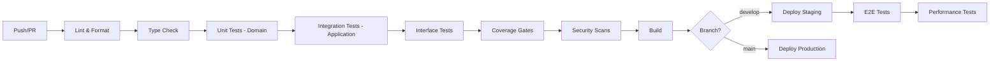

# 5.b Test Plans & QA Strategies

Created by: Abe Caymo
Created time: February 18, 2025 4:31 PM
Category: Engineering, Strategy doc
Last edited by: Document Review Panel
Last updated time: January 15, 2026

# **Testing Practices & Strategies**

*Aptivo Agentic Platform*

*v2.0.0 – [January 15, 2026]*

*Aligned with: Coding Guidelines v3.0.0, TSD v3.0.0, FRD v1.0.0*

---

## **1. Introduction**

### 1.1 Purpose
This document outlines the official testing methodologies, management processes, and quality metrics for Aptivo. The goal is to ensure a high-quality, reliable, secure, and performant application through a structured and collaborative testing approach that aligns with our functional architecture principles.

### 1.2 Scope
These strategies apply to all code and infrastructure changes across all modules of the project, following the Domain-Driven Design modular structure:
- `apps/web/src/modules/*/domain/` - Pure business logic
- `apps/web/src/modules/*/application/` - Service orchestration
- `apps/web/src/modules/*/infrastructure/` - External integrations
- `apps/web/src/modules/*/interface/` - API routes and UI components

### 1.3 Audience
This document is intended for all Developers and Quality Assurance (QA) Engineers involved in the project.

### 1.4 Related Documents
- **Coding Guidelines v3.0.0** - Testing patterns and coverage requirements
- **TSD v3.0.0** - Technical specifications and API contracts
- **FRD v1.0.0** - Functional requirements with acceptance criteria

---

## Traceability

| Requirement | Source | How Addressed |
|-------------|--------|---------------|
| Quality targets | FRD §10.1 (Non-Functional Requirements — Performance) | Coverage targets per architectural layer |
| Acceptance testing | FRD acceptance criteria (§3–§9) | E2E tests with Playwright |
| Security testing | ADD §6, ADD §14 | Auth/authz test patterns, Zero Trust validation |
| Performance targets | FRD §10 (Non-Functional Requirements) | P95 < 500ms via k6 load tests; HITL <10s P95 |
| Result type testing | TSD §4.2 | Tagged union discrimination in assertions |

---

## **2. Testing Philosophy**

### 2.1 Functional Core, Imperative Shell
Our testing strategy follows the architectural principle of separating pure logic from side effects:

| Layer | Purity | Testing Focus | Coverage Target |
|-------|--------|---------------|-----------------|
| Domain | Pure functions | Input/output correctness, edge cases | **100%** |
| Application | Orchestration | Service composition, dependency injection | **80%** |
| Interface | Side effects | API contracts, UI behavior | **60%** |

### 2.2 Parse, Don't Validate (Zero Trust)
All external inputs must be validated at system boundaries using Zod schemas. Tests must verify:
- Valid inputs produce expected outputs
- Invalid inputs are rejected before reaching domain logic
- Error responses conform to RFC 7807 Problem Details

### 2.3 Result Type Testing
All domain and application functions return `Result<T, E>` types. Tests must assert on:
- `result.success` (boolean) - not `result.ok`
- `result.data` for success cases
- `result.error._tag` for failure cases (tagged union discrimination)

---

## **3. Testing Methodologies & Scope**

A multi-layered testing approach ensures comprehensive coverage aligned with the architectural layers.

### 3.1 Unit Testing (Domain Layer)

- **Description:** Testing of pure functions in the domain layer in complete isolation. No mocks required for pure functions.
- **Tools:** Vitest 4.x (see [project-structure.md](../04-specs/project-structure.md) for canonical versions)
- **Responsibility:** Developers
- **Coverage:** **100% required**
- **Scope:**
  - `apps/web/src/modules/*/domain/` - Business logic, calculations, validations
  - `packages/domain/` - Functional utility functions
  - Zod schema validation logic

```typescript
// apps/web/src/modules/candidate-management/tests/domain/candidate.test.ts
import { describe, it, expect } from 'vitest';
import { validateCandidateStatus, calculateExperience } from '../../domain/candidate';
import { CandidateStatusSchema } from '../../domain/validations';

describe('Candidate Domain Logic', () => {
  describe('validateCandidateStatus', () => {
    it('should accept valid status transitions', () => {
      const result = validateCandidateStatus('new', 'screening');

      expect(result.success).toBe(true);
      if (result.success) {
        expect(result.data).toBe('screening');
      }
    });

    it('should reject invalid status transitions', () => {
      const result = validateCandidateStatus('new', 'hired');

      expect(result.success).toBe(false);
      if (!result.success) {
        expect(result.error._tag).toBe('InvalidStatusTransition');
      }
    });
  });

  describe('Zod Schema Validation', () => {
    it('should validate email format', () => {
      const result = CandidateStatusSchema.safeParse('invalid-status');

      expect(result.success).toBe(false);
    });

    it('should accept valid status values', () => {
      const result = CandidateStatusSchema.safeParse('screening');

      expect(result.success).toBe(true);
    });
  });
});
```

### 3.2 Integration Testing (Application Layer)

- **Description:** Testing service orchestration with mocked dependencies using factory functions. Verifies that application services correctly compose domain logic with infrastructure.
- **Tools:** Vitest 4.x (see [project-structure.md](../04-specs/project-structure.md) for canonical versions)
- **Responsibility:** Developers
- **Coverage:** **80% required**
- **Scope:** `apps/web/src/modules/*/application/` - Service composition, event publishing

```typescript
// apps/web/src/modules/candidate-management/tests/application/candidate-service.test.ts
import { describe, it, expect, vi, beforeEach } from 'vitest';
import { createCandidate, updateCandidateStatus } from '../../application/candidate-service';
import type { CandidateDeps } from '../../application/types';

describe('CandidateService', () => {
  // create mock dependencies for factory function pattern
  const createMockDeps = (): CandidateDeps => ({
    candidateRepository: {
      findById: vi.fn(),
      save: vi.fn(),
      findByEmail: vi.fn(),
    },
    eventPublisher: {
      publish: vi.fn(),
    },
    logger: {
      info: vi.fn(),
      error: vi.fn(),
      warn: vi.fn(),
      debug: vi.fn(),
    },
  });

  describe('createCandidate', () => {
    it('should create candidate and publish event on success', async () => {
      const mockDeps = createMockDeps();
      mockDeps.candidateRepository.findByEmail.mockResolvedValue(null);
      mockDeps.candidateRepository.save.mockResolvedValue({
        id: '01910c29-8a3d-7e0e-9e3a-1234567890ab',
        name: 'Jane Doe',
        email: 'jane@example.com',
        status: 'new',
      });
      mockDeps.eventPublisher.publish.mockResolvedValue(undefined);

      const result = await createCandidate({
        name: 'Jane Doe',
        email: 'jane@example.com',
      })(mockDeps);

      expect(result.success).toBe(true);
      if (result.success) {
        expect(result.data.id).toBeDefined();
        expect(result.data.status).toBe('new');
      }
      expect(mockDeps.eventPublisher.publish).toHaveBeenCalledWith(
        'candidate.created',
        expect.objectContaining({ email: 'jane@example.com' })
      );
    });

    it('should return error for duplicate email', async () => {
      const mockDeps = createMockDeps();
      mockDeps.candidateRepository.findByEmail.mockResolvedValue({
        id: 'existing-id',
        email: 'jane@example.com',
      });

      const result = await createCandidate({
        name: 'Jane Doe',
        email: 'jane@example.com',
      })(mockDeps);

      expect(result.success).toBe(false);
      if (!result.success) {
        expect(result.error._tag).toBe('DuplicateEmailError');
      }
      expect(mockDeps.candidateRepository.save).not.toHaveBeenCalled();
    });

    it('should handle persistence errors gracefully', async () => {
      const mockDeps = createMockDeps();
      mockDeps.candidateRepository.findByEmail.mockResolvedValue(null);
      mockDeps.candidateRepository.save.mockRejectedValue(new Error('DB connection failed'));

      const result = await createCandidate({
        name: 'Jane Doe',
        email: 'jane@example.com',
      })(mockDeps);

      expect(result.success).toBe(false);
      if (!result.success) {
        expect(result.error._tag).toBe('PersistenceError');
        expect(result.error.operation).toBe('save');
      }
    });
  });
});
```

### 3.3 Interface Testing (API & UI)

- **Description:** Testing API routes and UI components for correct request/response handling and RFC 7807 compliance.
- **Tools:** Vitest 4.x (see [project-structure.md](../04-specs/project-structure.md) for canonical versions) (API), Playwright Component Testing (UI)
- **Responsibility:** Developers
- **Coverage:** **60% required**
- **Scope:** `apps/web/src/modules/*/interface/` - API routes, React components

```typescript
// apps/web/src/modules/candidate-management/tests/interface/api.test.ts
import { describe, it, expect, vi } from 'vitest';
import { POST } from '../../interface/api/candidates/route';
import { NextRequest } from 'next/server';

describe('Candidate API Routes', () => {
  describe('POST /api/candidates', () => {
    it('should return 201 with candidate data on success', async () => {
      const request = new NextRequest('http://localhost/api/candidates', {
        method: 'POST',
        body: JSON.stringify({ name: 'Jane Doe', email: 'jane@example.com' }),
      });

      const response = await POST(request);
      const data = await response.json();

      expect(response.status).toBe(201);
      expect(data.id).toBeDefined();
    });

    it('should return RFC 7807 Problem Details on validation error', async () => {
      const request = new NextRequest('http://localhost/api/candidates', {
        method: 'POST',
        body: JSON.stringify({ name: '', email: 'invalid-email' }),
      });

      const response = await POST(request);
      const problem = await response.json();

      expect(response.status).toBe(400);
      expect(response.headers.get('Content-Type')).toBe('application/problem+json');

      // RFC 7807 compliance assertions
      expect(problem.type).toMatch(/\/errors\/validation-error$/);
      expect(problem.title).toBe('Validation Error');
      expect(problem.status).toBe(400);
      expect(problem.errors).toBeInstanceOf(Array);
      expect(problem.errors).toContainEqual(
        expect.objectContaining({ field: 'email' })
      );
    });

    it('should return RFC 7807 Problem Details on not found', async () => {
      const request = new NextRequest('http://localhost/api/candidates/nonexistent', {
        method: 'GET',
      });

      const response = await GET(request, { params: { id: 'nonexistent' } });
      const problem = await response.json();

      expect(response.status).toBe(404);
      expect(problem.type).toMatch(/\/errors\/not-found$/);
      expect(problem.title).toBe('Resource Not Found');
    });
  });
});
```

### 3.4 End-to-End (E2E) Testing

- **Description:** Simulates complete user workflows from the user interface (UI) to the database and back. These tests validate the system from a user's perspective.
- **Tools:** Playwright 1.45+
- **Responsibility:** QA Engineers
- **Scope:** Critical user flows such as candidate onboarding, status transitions, and search functionality.

### 3.5 Performance Testing

- **Description:** Measures the responsiveness, stability, and scalability of the application under various load conditions.
- **Tools:** k6 (for load testing APIs), Lighthouse CI (for frontend performance analysis)
- **Responsibility:** QA Engineers, with support from Developers
- **Scope:**
  - API response time and throughput testing
  - Frontend Core Web Vitals (LCP, FID, CLS)
  - Database query performance under load
  - HITL request delivery latency: <10s P95 (BRD §5.1) — measured from workflow signal emit to notification delivery confirmation

### 3.6 Security Testing

- **Description:** A comprehensive security testing strategy covering static analysis, dynamic testing, and supply chain security.
- **Tools:** See Section 9 for detailed tooling
- **Responsibility:** QA Engineers & Security Lead
- **Scope:**
  - Static Application Security Testing (SAST)
  - Dynamic Application Security Testing (DAST)
  - Software Composition Analysis (SCA)
  - Secrets scanning
  - Zero Trust control validation

### 3.7 Regression Testing

- **Description:** A suite of automated E2E and critical integration tests that are run before every release to ensure that new changes have not adversely affected existing functionality.
- **Tools:** Playwright
- **Responsibility:** QA Engineers (automation), with all team members participating in manual regression checks if needed.

---

## **4. Vitest Patterns & Best Practices**

### 4.1 Modern Mocking with vi.hoisted()

**Critical:** `vi.mock()` calls are hoisted to the top of the file. Use `vi.hoisted()` for mock state that needs to be defined before hoisting.

```typescript
// ❌ BAD - This will fail (mock variable undefined during hoist)
import { db } from '@/lib/db';
const mockDb = { query: vi.fn() };
vi.mock('@/lib/db', () => ({ db: mockDb })); // mockDb is undefined!

// ✅ GOOD - Use vi.hoisted() for mock state
import { db } from '@/lib/db';

const { mockQuery } = vi.hoisted(() => ({
  mockQuery: vi.fn(),
}));

vi.mock('@/lib/db', () => ({
  db: { query: mockQuery },
}));

describe('CandidateRepository', () => {
  beforeEach(() => {
    mockQuery.mockReset();
  });

  it('should query candidates', async () => {
    mockQuery.mockResolvedValue([{ id: '1', name: 'Jane' }]);
    // ...test logic
  });
});
```

### 4.2 Test Fixtures with test.extend()

Use `test.extend()` to create reusable test fixtures for common setup patterns.

```typescript
// apps/web/src/test/fixtures/candidate.fixture.ts
import { test as base } from 'vitest';
import type { CandidateDeps } from '@/modules/candidate-management/application/types';

interface CandidateFixtures {
  mockDeps: CandidateDeps;
  sampleCandidate: { id: string; name: string; email: string };
}

export const test = base.extend<CandidateFixtures>({
  mockDeps: async ({}, use) => {
    const deps: CandidateDeps = {
      candidateRepository: {
        findById: vi.fn(),
        save: vi.fn(),
        findByEmail: vi.fn(),
      },
      eventPublisher: { publish: vi.fn() },
      logger: { info: vi.fn(), error: vi.fn(), warn: vi.fn(), debug: vi.fn() },
    };
    await use(deps);
  },
  sampleCandidate: async ({}, use) => {
    await use({
      id: '01910c29-8a3d-7e0e-9e3a-1234567890ab',
      name: 'Jane Doe',
      email: 'jane@example.com',
    });
  },
});

// usage in tests
import { test } from '@/test/fixtures/candidate.fixture';

test('should create candidate', async ({ mockDeps, sampleCandidate }) => {
  mockDeps.candidateRepository.save.mockResolvedValue(sampleCandidate);
  // ...test logic
});
```

### 4.3 Testing Zod Schemas

All Zod schemas require comprehensive testing at the domain layer.

```typescript
// apps/web/src/modules/candidate-management/tests/domain/validations.test.ts
import { describe, it, expect } from 'vitest';
import {
  CandidateSchema,
  CandidateCreateSchema,
  CandidateStatusSchema
} from '../../domain/validations';

describe('Candidate Validation Schemas', () => {
  describe('CandidateCreateSchema', () => {
    it('should accept valid candidate data', () => {
      const result = CandidateCreateSchema.safeParse({
        name: 'Jane Doe',
        email: 'jane@example.com',
        phone: '+1234567890',
      });

      expect(result.success).toBe(true);
    });

    it('should reject empty name', () => {
      const result = CandidateCreateSchema.safeParse({
        name: '',
        email: 'jane@example.com',
      });

      expect(result.success).toBe(false);
      if (!result.success) {
        expect(result.error.issues[0].path).toContain('name');
      }
    });

    it('should reject invalid email format', () => {
      const result = CandidateCreateSchema.safeParse({
        name: 'Jane Doe',
        email: 'not-an-email',
      });

      expect(result.success).toBe(false);
      if (!result.success) {
        expect(result.error.issues[0].path).toContain('email');
        expect(result.error.issues[0].code).toBe('invalid_string');
      }
    });

    it('should handle refinement edge cases', () => {
      // test custom refinements like name length limits
      const result = CandidateCreateSchema.safeParse({
        name: 'A'.repeat(256), // exceeds max length
        email: 'jane@example.com',
      });

      expect(result.success).toBe(false);
    });
  });

  describe('CandidateStatusSchema', () => {
    const validStatuses = ['new', 'screening', 'interview', 'offer', 'hired', 'rejected'];

    it.each(validStatuses)('should accept valid status: %s', (status) => {
      const result = CandidateStatusSchema.safeParse(status);
      expect(result.success).toBe(true);
    });

    it('should reject invalid status', () => {
      const result = CandidateStatusSchema.safeParse('invalid-status');
      expect(result.success).toBe(false);
    });
  });
});
```

### 4.4 Testing Result Types

Test both success and error branches of Result-returning functions.

```typescript
// apps/web/src/modules/candidate-management/tests/application/result-patterns.test.ts
import { describe, it, expect } from 'vitest';
import { Result } from '@aptivo/types';
import { processCandidate } from '../../application/candidate-processor';

describe('Result Type Testing Patterns', () => {
  describe('Success Cases', () => {
    it('should return success result with data', async () => {
      const result = await processCandidate(validInput)(mockDeps);

      // always check success first
      expect(result.success).toBe(true);

      // type narrowing after success check
      if (result.success) {
        expect(result.data.id).toBeDefined();
        expect(result.data.status).toBe('processed');
      }
    });
  });

  describe('Error Cases', () => {
    it('should return tagged error for validation failures', async () => {
      const result = await processCandidate(invalidInput)(mockDeps);

      expect(result.success).toBe(false);

      if (!result.success) {
        // discriminate on _tag for specific error handling
        expect(result.error._tag).toBe('ZodValidationError');
        expect(result.error.cause.issues).toBeDefined();
      }
    });

    it('should return tagged error for persistence failures', async () => {
      mockDeps.repository.save.mockRejectedValue(new Error('DB Error'));

      const result = await processCandidate(validInput)(mockDeps);

      expect(result.success).toBe(false);

      if (!result.success) {
        expect(result.error._tag).toBe('PersistenceError');
        expect(result.error.operation).toBe('save');
        expect(result.error.cause).toBeInstanceOf(Error);
      }
    });
  });

  describe('Table-Driven Tests', () => {
    const testCases = [
      { input: { name: 'Valid', email: 'v@e.com' }, expectedSuccess: true },
      { input: { name: '', email: 'v@e.com' }, expectedSuccess: false, expectedTag: 'ZodValidationError' },
      { input: { name: 'Valid', email: 'bad' }, expectedSuccess: false, expectedTag: 'ZodValidationError' },
    ];

    it.each(testCases)(
      'should handle input: $input.name / $input.email',
      async ({ input, expectedSuccess, expectedTag }) => {
        const result = await processCandidate(input)(mockDeps);

        expect(result.success).toBe(expectedSuccess);
        if (!expectedSuccess && expectedTag && !result.success) {
          expect(result.error._tag).toBe(expectedTag);
        }
      }
    );
  });
});
```

### 4.5 Testing Factory Function Services

Test service composition with the factory function pattern.

```typescript
// example: testing a service created with createService(deps)
import { describe, it, expect, vi } from 'vitest';
import { createCandidateService } from '../../application/candidate-service';
import type { CandidateServiceDeps } from '../../application/types';

describe('CandidateService composition', () => {
  const mockDeps: CandidateServiceDeps = {
    candidateRepo: { findById: vi.fn(), save: vi.fn() },
    eventPublisher: { publish: vi.fn() },
    logger: { info: vi.fn(), warn: vi.fn(), error: vi.fn() },
  };

  it('should compose operations and propagate success', async () => {
    vi.mocked(mockDeps.candidateRepo.findById).mockResolvedValue({ id: '1', status: 'new' });
    vi.mocked(mockDeps.candidateRepo.save).mockResolvedValue({ id: '1', status: 'screening' });

    const service = createCandidateService(mockDeps);
    const result = await service.updateStatus('1', 'screening');

    expect(result.ok).toBe(true);
    expect(mockDeps.eventPublisher.publish).toHaveBeenCalledWith(
      'candidate.status.changed',
      expect.objectContaining({ status: 'screening' })
    );
  });

  it('should return error and skip subsequent steps on failure', async () => {
    vi.mocked(mockDeps.candidateRepo.findById).mockResolvedValue(null);

    const service = createCandidateService(mockDeps);
    const result = await service.updateStatus('nonexistent', 'screening');

    expect(result.ok).toBe(false);
    if (!result.ok) {
      expect(result.error._tag).toBe('NotFoundError');
    }
    // subsequent operations should not be called
    expect(mockDeps.candidateRepo.save).not.toHaveBeenCalled();
    expect(mockDeps.eventPublisher.publish).not.toHaveBeenCalled();
  });
});
```

---

## **5. Playwright Patterns & Best Practices**

### 5.1 Page Object Model

Encapsulate page interactions for maintainable E2E tests.

```typescript
// tests/pages/candidates.page.ts
import { Page, Locator } from '@playwright/test';

export class CandidatesPage {
  readonly page: Page;
  readonly addButton: Locator;
  readonly nameInput: Locator;
  readonly emailInput: Locator;
  readonly submitButton: Locator;
  readonly successToast: Locator;
  readonly errorToast: Locator;

  constructor(page: Page) {
    this.page = page;
    this.addButton = page.getByTestId('add-candidate-btn');
    this.nameInput = page.getByTestId('candidate-name');
    this.emailInput = page.getByTestId('candidate-email');
    this.submitButton = page.getByTestId('submit-btn');
    this.successToast = page.getByTestId('success-toast');
    this.errorToast = page.getByTestId('error-toast');
  }

  async navigateTo() {
    await this.page.goto('/candidates');
    await this.page.waitForLoadState('networkidle');
  }

  async createCandidate(data: { name: string; email: string }) {
    await this.addButton.click();
    await this.nameInput.fill(data.name);
    await this.emailInput.fill(data.email);
    await this.submitButton.click();
  }

  async waitForSuccess() {
    await this.successToast.waitFor({ state: 'visible' });
  }

  async waitForError() {
    await this.errorToast.waitFor({ state: 'visible' });
  }
}
```

### 5.2 Component Testing

Use Playwright Component Testing for isolated UI component tests without full E2E overhead.

```typescript
// tests/components/candidate-form.spec.tsx
import { test, expect } from '@playwright/experimental-ct-react';
import { CandidateForm } from '@/modules/candidate-management/interface/components/CandidateForm';

test.describe('CandidateForm Component', () => {
  test('should render form fields', async ({ mount }) => {
    const component = await mount(<CandidateForm onSubmit={() => {}} />);

    await expect(component.getByLabel('Name')).toBeVisible();
    await expect(component.getByLabel('Email')).toBeVisible();
    await expect(component.getByRole('button', { name: 'Submit' })).toBeVisible();
  });

  test('should show validation errors on invalid input', async ({ mount }) => {
    const component = await mount(<CandidateForm onSubmit={() => {}} />);

    await component.getByRole('button', { name: 'Submit' }).click();

    await expect(component.getByText('Name is required')).toBeVisible();
    await expect(component.getByText('Invalid email')).toBeVisible();
  });

  test('should call onSubmit with valid data', async ({ mount }) => {
    let submittedData: unknown = null;
    const component = await mount(
      <CandidateForm onSubmit={(data) => { submittedData = data; }} />
    );

    await component.getByLabel('Name').fill('Jane Doe');
    await component.getByLabel('Email').fill('jane@example.com');
    await component.getByRole('button', { name: 'Submit' }).click();

    expect(submittedData).toEqual({
      name: 'Jane Doe',
      email: 'jane@example.com',
    });
  });
});
```

### 5.3 API Mocking

Use `page.route()` to mock API responses for reliable, fast E2E tests.

```typescript
// tests/e2e/candidates.spec.ts
import { test, expect } from '@playwright/test';
import { CandidatesPage } from '../pages/candidates.page';

test.describe('Candidate Management E2E', () => {
  test('should display candidates from API', async ({ page }) => {
    // mock the API response
    await page.route('**/api/candidates', async (route) => {
      await route.fulfill({
        status: 200,
        contentType: 'application/json',
        body: JSON.stringify([
          { id: '1', name: 'Jane Doe', email: 'jane@example.com', status: 'new' },
          { id: '2', name: 'John Smith', email: 'john@example.com', status: 'screening' },
        ]),
      });
    });

    const candidatesPage = new CandidatesPage(page);
    await candidatesPage.navigateTo();

    await expect(page.getByText('Jane Doe')).toBeVisible();
    await expect(page.getByText('John Smith')).toBeVisible();
  });

  test('should handle API errors gracefully', async ({ page }) => {
    // mock an error response with RFC 7807 format
    await page.route('**/api/candidates', async (route) => {
      await route.fulfill({
        status: 500,
        contentType: 'application/problem+json',
        body: JSON.stringify({
          type: 'https://api.aptivo.com/errors/internal-error',
          title: 'Internal Server Error',
          status: 500,
          detail: 'Database connection failed',
        }),
      });
    });

    const candidatesPage = new CandidatesPage(page);
    await candidatesPage.navigateTo();

    await expect(page.getByText('Something went wrong')).toBeVisible();
  });

  test('should create candidate successfully', async ({ page }) => {
    // mock POST endpoint
    await page.route('**/api/candidates', async (route) => {
      if (route.request().method() === 'POST') {
        await route.fulfill({
          status: 201,
          contentType: 'application/json',
          body: JSON.stringify({
            id: '3',
            name: 'New Candidate',
            email: 'new@example.com',
            status: 'new',
          }),
        });
      } else {
        await route.continue();
      }
    });

    const candidatesPage = new CandidatesPage(page);
    await candidatesPage.navigateTo();
    await candidatesPage.createCandidate({
      name: 'New Candidate',
      email: 'new@example.com',
    });

    await candidatesPage.waitForSuccess();
  });
});
```

### 5.4 Accessibility Testing

Integrate accessibility audits into E2E tests.

```typescript
// tests/e2e/accessibility.spec.ts
import { test, expect } from '@playwright/test';
import AxeBuilder from '@axe-core/playwright';

test.describe('Accessibility Audits', () => {
  test('candidates page should have no accessibility violations', async ({ page }) => {
    await page.goto('/candidates');
    await page.waitForLoadState('networkidle');

    const accessibilityScanResults = await new AxeBuilder({ page })
      .withTags(['wcag2a', 'wcag2aa', 'wcag21aa'])
      .analyze();

    expect(accessibilityScanResults.violations).toEqual([]);
  });

  test('candidate form should be keyboard navigable', async ({ page }) => {
    await page.goto('/candidates/new');

    // tab through form elements
    await page.keyboard.press('Tab');
    await expect(page.getByLabel('Name')).toBeFocused();

    await page.keyboard.press('Tab');
    await expect(page.getByLabel('Email')).toBeFocused();

    await page.keyboard.press('Tab');
    await expect(page.getByRole('button', { name: 'Submit' })).toBeFocused();
  });
});
```

### 5.5 Visual Regression Testing

Capture and compare screenshots for visual consistency.

```typescript
// tests/e2e/visual.spec.ts
import { test, expect } from '@playwright/test';

test.describe('Visual Regression', () => {
  test('candidates list should match snapshot', async ({ page }) => {
    await page.goto('/candidates');
    await page.waitForLoadState('networkidle');

    await expect(page).toHaveScreenshot('candidates-list.png', {
      maxDiffPixels: 100,
    });
  });

  test('empty state should match snapshot', async ({ page }) => {
    await page.route('**/api/candidates', async (route) => {
      await route.fulfill({
        status: 200,
        body: JSON.stringify([]),
      });
    });

    await page.goto('/candidates');

    await expect(page).toHaveScreenshot('candidates-empty.png');
  });
});
```

---

## **6. Testing RFC 7807 Error Responses**

All API error responses must conform to RFC 7807 Problem Details format. This section provides testing patterns for compliance.

### 6.1 Problem Details Schema Validation

```typescript
// apps/web/src/test/utils/problem-details.ts
import { z } from 'zod';

export const ProblemDetailsSchema = z.object({
  type: z.string().url(),
  title: z.string(),
  status: z.number().int().min(400).max(599),
  detail: z.string().optional(),
  instance: z.string().optional(),
  traceId: z.string().optional(),
  errors: z.array(z.object({
    field: z.string(),
    message: z.string(),
    code: z.string().optional(),
  })).optional(),
});

export type ProblemDetails = z.infer<typeof ProblemDetailsSchema>;

export function assertProblemDetails(response: unknown): asserts response is ProblemDetails {
  const result = ProblemDetailsSchema.safeParse(response);
  if (!result.success) {
    throw new Error(`Invalid Problem Details format: ${result.error.message}`);
  }
}
```

### 6.2 API Error Response Testing

```typescript
// apps/web/src/modules/candidate-management/tests/interface/error-responses.test.ts
import { describe, it, expect } from 'vitest';
import { assertProblemDetails } from '@/test/utils/problem-details';

describe('RFC 7807 Compliance', () => {
  const ERROR_TYPE_BASE = 'https://api.aptivo.com/errors';

  describe('Validation Errors (400)', () => {
    it('should return valid Problem Details for validation errors', async () => {
      const response = await fetch('/api/candidates', {
        method: 'POST',
        body: JSON.stringify({ name: '', email: 'invalid' }),
      });
      const body = await response.json();

      expect(response.status).toBe(400);
      expect(response.headers.get('Content-Type')).toBe('application/problem+json');

      assertProblemDetails(body);
      expect(body.type).toBe(`${ERROR_TYPE_BASE}/validation-error`);
      expect(body.title).toBe('Validation Error');
      expect(body.status).toBe(400);
      expect(body.errors).toBeDefined();
      expect(body.errors!.length).toBeGreaterThan(0);
    });
  });

  describe('Not Found Errors (404)', () => {
    it('should return valid Problem Details for not found', async () => {
      const response = await fetch('/api/candidates/nonexistent');
      const body = await response.json();

      expect(response.status).toBe(404);
      assertProblemDetails(body);
      expect(body.type).toBe(`${ERROR_TYPE_BASE}/not-found`);
      expect(body.title).toBe('Resource Not Found');
    });
  });

  describe('Server Errors (500)', () => {
    it('should return valid Problem Details without exposing internals', async () => {
      // trigger a server error (mock or test scenario)
      const response = await fetch('/api/test/trigger-error');
      const body = await response.json();

      expect(response.status).toBe(500);
      assertProblemDetails(body);
      expect(body.type).toBe(`${ERROR_TYPE_BASE}/internal-error`);
      expect(body.detail).not.toContain('stack');
      expect(body.detail).not.toContain('password');
    });
  });
});
```

---

## **7. CI/CD Pipeline**

Our Continuous Integration and Continuous Deployment pipeline is orchestrated via GitHub Actions and ensures that every change is automatically tested before being deployed.

### 7.1 Pipeline Stages



### 7.2 Automated Checks

1. **Lint & Format:** Code is checked against ESLint flat config and Prettier rules.
2. **Type Check:** TypeScript strict mode compilation with no errors.
3. **Unit Tests:** Domain layer tests with **100% coverage gate**.
4. **Integration Tests:** Application layer tests with **80% coverage gate**.
5. **Interface Tests:** API and UI tests with **60% coverage gate**.
6. **Security Scans:** SAST, SCA, and secrets scanning (see Section 9).
7. **Build:** Production build must succeed.

### 7.3 Tiered Coverage Configuration

```typescript
// vitest.config.ts
import { defineConfig } from 'vitest/config';

export default defineConfig({
  test: {
    coverage: {
      provider: 'v8',
      reporter: ['text', 'json', 'html', 'lcov'],
      exclude: [
        'node_modules/',
        'tests/',
        '**/*.test.ts',
        '**/*.spec.ts',
      ],
      thresholds: {
        // domain layer: 100% coverage required
        'apps/web/src/modules/**/domain/**/*.ts': {
          statements: 100,
          branches: 100,
          functions: 100,
          lines: 100,
        },
        // application layer: 80% coverage required
        'apps/web/src/modules/**/application/**/*.ts': {
          statements: 80,
          branches: 80,
          functions: 80,
          lines: 80,
        },
        // interface layer: 60% coverage required
        'apps/web/src/modules/**/interface/**/*.ts': {
          statements: 60,
          branches: 60,
          functions: 60,
          lines: 60,
        },
        // overall: 80% minimum
        global: {
          statements: 80,
          branches: 80,
          functions: 80,
          lines: 80,
        },
      },
    },
  },
});
```

### 7.4 GitHub Actions Workflow

```yaml
# .github/workflows/ci.yml
name: CI Pipeline

on:
  push:
    branches: [main, develop]
  pull_request:
    branches: [main, develop]

jobs:
  lint-and-type-check:
    runs-on: ubuntu-latest
    steps:
      - uses: actions/checkout@v4
      - uses: pnpm/action-setup@v3
      - uses: actions/setup-node@v4
        with:
          node-version: '22'
          cache: 'pnpm'
      - run: pnpm install --frozen-lockfile
      - run: pnpm run lint
      - run: pnpm run type-check

  unit-tests:
    runs-on: ubuntu-latest
    needs: lint-and-type-check
    steps:
      - uses: actions/checkout@v4
      - uses: pnpm/action-setup@v3
      - uses: actions/setup-node@v4
        with:
          node-version: '22'
          cache: 'pnpm'
      - run: pnpm install --frozen-lockfile
      - run: pnpm run test:unit --coverage
      - name: Check Domain Coverage (100%)
        run: |
          coverage=$(jq '.total.lines.pct' coverage/coverage-summary.json)
          if (( $(echo "$coverage < 100" | bc -l) )); then
            echo "Domain coverage $coverage% is below 100% threshold"
            exit 1
          fi

  integration-tests:
    runs-on: ubuntu-latest
    needs: unit-tests
    services:
      postgres:
        image: postgres:16
        env:
          POSTGRES_PASSWORD: test
        ports:
          - 5432:5432
    steps:
      - uses: actions/checkout@v4
      - uses: pnpm/action-setup@v3
      - uses: actions/setup-node@v4
        with:
          node-version: '22'
          cache: 'pnpm'
      - run: pnpm install --frozen-lockfile
      - run: pnpm run test:integration --coverage

  security-scan:
    runs-on: ubuntu-latest
    needs: lint-and-type-check
    steps:
      - uses: actions/checkout@v4
      - name: Run SAST
        uses: github/codeql-action/analyze@v3
      - name: Run SCA
        run: pnpm audit --audit-level=high
      - name: Scan for secrets
        uses: trufflesecurity/trufflehog@main
        with:
          path: ./
          base: ${{ github.event.repository.default_branch }}

  e2e-tests:
    runs-on: ubuntu-latest
    needs: [integration-tests, security-scan]
    if: github.ref == 'refs/heads/develop'
    steps:
      - uses: actions/checkout@v4
      - uses: pnpm/action-setup@v3
      - uses: actions/setup-node@v4
        with:
          node-version: '22'
          cache: 'pnpm'
      - run: pnpm install --frozen-lockfile
      - run: pnpm exec playwright install --with-deps
      - run: pnpm run test:e2e
      - uses: actions/upload-artifact@v4
        if: failure()
        with:
          name: playwright-report
          path: playwright-report/
```

### 7.5 Code Review Requirements

A peer review from at least one other developer is required for the PR to be approved. Reviewers must validate:
- Adherence to Coding Guidelines v3.0.0
- Test coverage meets tiered requirements
- No security vulnerabilities introduced
- RFC 7807 compliance for any new API endpoints

---

## **8. Test Management & Documentation**

### 8.1 Test Case Documentation

All test cases for E2E, performance, and security testing will be documented in a centralized test management platform. Each test case will include:
- Description
- Steps to reproduce
- Expected results
- Mapping to FRD requirements

### 8.2 Requirement Traceability

To ensure complete traceability from business requirements to code, all tests must be mapped back to the source requirement documents (FRD v1.0.0, TSD v3.0.0).

**Convention:** A TSDoc block precedes every test suite (`describe` block).

```typescript
/**
 * @testcase CM-FRD-CM2-001
 * @description Tests the candidate status workflow transitions.
 * @requirements FRD-CM2, TSD-specs/candidate-management.md
 * @acceptance-criteria
 *   - AC1: Status can transition from 'new' to 'screening'
 *   - AC2: Invalid transitions are rejected with appropriate error
 */
describe('Candidate Status Workflow', () => {
  test('AC1: should transition candidate from new to screening', async () => {
    // ...test logic...
  });

  test('AC2: should reject invalid status transition', async () => {
    // ...test logic...
  });
});
```

### 8.3 Coverage Reporting

Coverage reports are generated and stored as CI artifacts. Reports must show:
- Per-layer coverage percentages
- Uncovered lines/branches
- Trend over time

---

## **9. Security Testing**

### 9.1 Static Application Security Testing (SAST)

- **Tool:** CodeQL (GitHub Advanced Security) or Semgrep
- **Scope:** All TypeScript/JavaScript code
- **Frequency:** Every PR, daily scans on main branch
- **Rules:** OWASP Top 10, CWE Top 25

### 9.2 Software Composition Analysis (SCA)

- **Tool:** npm audit, Snyk, or Dependabot
- **Scope:** All npm dependencies
- **Frequency:** Every PR, weekly full scans
- **Policy:**
  - Critical vulnerabilities: Block merge
  - High vulnerabilities: Block merge (unless mitigated)
  - Medium/Low: Track and remediate within sprint

### 9.3 Secrets Scanning

- **Tool:** TruffleHog, GitLeaks, or GitHub Secret Scanning
- **Scope:** All code, commit history
- **Frequency:** Every commit
- **Policy:** Any detected secret blocks merge immediately

### 9.4 SBOM Generation

- **Tool:** Syft or CycloneDX
- **Output:** Software Bill of Materials in CycloneDX format
- **Frequency:** Every release
- **Storage:** Attached to release artifacts

### 9.5 Dynamic Application Security Testing (DAST)

- **Tool:** OWASP ZAP or Burp Suite
- **Scope:** Staging environment APIs
- **Frequency:** Weekly automated scans, pre-release manual testing
- **Focus Areas:**
  - Authentication/Authorization bypass
  - Injection attacks
  - CORS misconfiguration
  - Security header validation

### 9.6 Zero Trust Control Validation

Tests must verify that Zero Trust security controls are enforced:

```typescript
describe('Zero Trust Authorization', () => {
  it('should reject requests without valid JWT', async () => {
    const response = await fetch('/api/candidates');

    expect(response.status).toBe(401);
  });

  it('should reject requests with insufficient permissions', async () => {
    const response = await fetch('/api/candidates', {
      headers: { Authorization: `Bearer ${tokenWithReadOnlyScope}` },
      method: 'POST',
      body: JSON.stringify({ name: 'Test', email: 'test@example.com' }),
    });

    expect(response.status).toBe(403);
  });

  it('should validate input at boundary before processing', async () => {
    const response = await fetch('/api/candidates', {
      headers: { Authorization: `Bearer ${validToken}` },
      method: 'POST',
      body: JSON.stringify({ name: '<script>alert(1)</script>', email: 'test@example.com' }),
    });

    // should sanitize or reject, never store raw
    const problem = await response.json();
    expect(response.status).toBe(400);
    expect(problem.type).toMatch(/validation-error/);
  });
});
```

---

## **10. Quality Metrics & KPIs**

The following metrics will be tracked to measure the effectiveness of our testing processes and the overall quality of the product.

| Metric | Target | Measurement |
|--------|--------|-------------|
| **Domain Layer Coverage** | 100% | Vitest coverage report |
| **Application Layer Coverage** | 80% | Vitest coverage report |
| **Interface Layer Coverage** | 60% | Vitest coverage report |
| **Overall Coverage** | 80% | Vitest coverage report |
| **CI Build Success Rate** | > 95% | GitHub Actions metrics |
| **Defect Density** | < 3 per major release | Bug tracking system |
| **Defect Removal Efficiency (DRE)** | > 90% | Pre/post release bug counts |
| **E2E Test Suite Pass Rate** | > 98% | Playwright reports |
| **API P95 Response Time** | < 500ms | k6 load test results |
| **Security Vulnerability Count** | 0 Critical/High | SAST/SCA reports |
| **MTTR (Mean Time to Recovery)** | < 1 hour | Incident tracking |

### 10.1 Metric Collection

Metrics are automatically collected and reported via:
- GitHub Actions workflow summaries
- Grafana dashboards (see [05d-Observability.md](./05d-Observability.md))
- Weekly QA reports to stakeholders

### 10.2 Quality Gates

The following gates must pass before code can be merged:

| Gate | Criteria |
|------|----------|
| PR Merge | All CI checks pass, coverage thresholds met, 1+ approvals |
| Staging Deploy | All integration tests pass, no critical security findings |
| Production Release | All E2E tests pass, QA sign-off, no known critical bugs |

---

## **11. Error Path & Negative Testing**

Every error path documented in the ADD must have a corresponding test specification. This section provides the framework for systematic error path testing.

### 11.1 Error Path Test Matrix

| Component | Error Path | Test Description | Expected Behavior | Priority |
|-----------|-----------|-----------------|-------------------|----------|
| MCP Layer | Circuit breaker open | Simulate 5 consecutive MCP server failures | CB opens; subsequent calls return `circuit_open` without hitting server | P1 |
| MCP Layer | Retry exhaustion | Simulate all 3 retry attempts failing | Workflow step receives `ExternalServiceError`; follows error path | P1 |
| LLM Gateway | Provider fallback | Primary provider returns 5xx | Automatic failover to secondary provider | P1 |
| LLM Gateway | Budget exceeded | Set daily budget to $0; make LLM request | Returns `DAILY_BUDGET_EXCEEDED` error | P1 |
| LLM Gateway | Both providers down | Both providers return 5xx | Workflow step receives `LLMError`; follows error path | P2 |
| HITL Gateway | TTL expiry | Create HITL request with 1s TTL | Workflow auto-resumes via TIMEOUT path | P1 |
| HITL Gateway | Duplicate approval | Submit approval twice for same request | Second returns 200 with `idempotent: true` | P1 |
| HITL Gateway | Concurrent approval race | Submit approve and reject simultaneously | One wins (database constraint); other returns 409 | P1 |
| Identity Service | Expired JWT | Send request with expired access token | Returns 401; client uses refresh token | P1 |
| Identity Service | JWKS cache stale | Simulate Supabase outage after JWKS cache | Requests succeed using cached JWKS (up to 24h) | P2 |
| Identity Service | MFA step-up required | Access sensitive operation without MFA enrollment | Returns 403 with `mfa_required` error; redirects to enrollment flow | P1 |
| Identity Service | MFA step-up with enrolled user | Access sensitive operation with MFA enrolled, no recent verification | Prompts for MFA verification before proceeding | P1 |
| Identity Service | MFA step-up bypass attempt | Attempt sensitive operation with expired MFA verification | Returns 403; requires re-verification (see ADD §8.6) | P1 |
| Audit Service | Write timeout | Simulate slow audit insert (>500ms) | Caller experiences delay; audit eventually written | P2 |
| Redis | Unavailable | Simulate Redis connection failure | Per-consumer degradation: MCP fail-closed, others fail-open | P1 |
| PostgreSQL | Connection pool exhaustion | Exhaust all pool connections | New requests receive connection error; no crash | P2 |
| File Storage | ClamAV down | Stop ClamAV container | Uploads succeed; files marked `scan_pending`; downloads blocked | P2 |
| Inbound Webhooks | Invalid signature | Send webhook with wrong HMAC | Returns 401; no processing | P1 |
| Inbound Webhooks | Duplicate delivery | Send same webhook ID twice | Second returns 200 with `deduplicated: true` | P1 |

### 11.2 Error Path Testing Guidelines

1. **Every documented error path needs a test**: If the ADD describes a fallback behavior, there must be a test that triggers and verifies it.
2. **Test the transition, not just the end state**: Verify that the system transitions correctly (e.g., circuit breaker moves from closed -> open -> half-open -> closed).
3. **Test recovery**: After triggering an error path, verify the system recovers when the fault is removed.
4. **Use fault injection**: Prefer injecting faults at the infrastructure level (kill container, drop connections) over mocking, for integration tests.
5. **Idempotency tests**: Every idempotent operation must be tested with duplicate inputs to verify duplicate handling.

---

## **12. Boundary Condition Testing**

Every numeric limit, threshold, and boundary documented in the ADD and API specification must have corresponding boundary tests.

### 12.1 Boundary Value Analysis Framework

For each boundary `B` with limit `L`:
- Test at `L-1` (just below limit): should succeed
- Test at `L` (at limit): should succeed
- Test at `L+1` (just above limit): should fail with documented error

### 12.2 Boundary Test Matrix

| Boundary | Limit Value | Test At Limit | Test Over Limit | Expected Error | Source |
|----------|------------|---------------|-----------------|---------------|--------|
| API rate limit (general) | 100 req/min | 100th request -> 200 OK | 101st request -> 429 | `TooManyRequests` | API Spec |
| Magic link rate limit | 5 req/min | 5th request -> 200 OK | 6th request -> 429 | `TooManyRequests` | API Spec |
| File upload size | 50 MiB (52,428,800 bytes) | 50 MiB file -> 200 OK | 50 MiB + 1 byte -> 413 | `PayloadTooLarge` | API Spec |
| Pagination limit | 200 items | `limit=200` -> 200 items | `limit=201` -> 400 or clamped to 200 | `ValidationError` | API Spec |
| LLM daily budget | $50/domain | $49.99 spend -> next request OK | $50.00 spend -> next request blocked | `DAILY_BUDGET_EXCEEDED` | ADD S7.2 |
| LLM monthly budget | $500/domain | $499.99 -> OK | $500.00 -> blocked | `MONTHLY_BUDGET_EXCEEDED` | ADD S7.2 |
| DB connection pool | 20 (or configured) | 20th connection -> OK | 21st connection -> error | Connection timeout | ADD S10 |
| HITL TTL | Per-policy (24h-7d) | Request at TTL-1s -> pending | Request at TTL -> auto-expire | TIMEOUT path | ADD S4.1 |
| JWKS stale-if-error | 24h | 23h59m -> cached JWKS valid | 24h01m -> JWKS expired, re-fetch required | Auth failure if Supabase down | ADD S2.3.2 |
| Permission cache TTL | 5 min | 4m59s -> cached permission used | 5m01s -> re-fetch from DB | Slight latency increase | ADD S5.6 |
| MCP response size | 1 MiB | 1 MiB response -> OK | 1 MiB + 1 byte -> truncated | `RESPONSE_TOO_LARGE` | ADD S5.3.1 |
| MCP retry budget | 37s (3x10s + backoff) | Total < 120s Inngest timeout -> OK | If increased: ensure < Inngest step timeout | Step timeout | ADD S2.3.3 |
| JSON body size | 1 MiB | 1 MiB body -> OK | >1 MiB -> 413 | `PayloadTooLarge` | API Spec |
| JSON nesting depth | 10 levels | 10 levels -> OK | 11 levels -> 400 | `BadRequest` | API Spec |
| Webhook dedup window | 7 days | Day 6 duplicate -> deduped | Day 8 duplicate -> processed as new | N/A (different behavior) | ADD S12.3 |

### 12.3 Boundary Testing Guidelines

1. **Test both sides**: Always test at-limit (should pass) AND over-limit (should fail).
2. **Document the exact limit value**: Use the actual configured value, not an approximation.
3. **Test limit enforcement location**: Verify where the limit is enforced (middleware, application, database) to ensure bypass is not possible.
4. **Test limit reset**: For rate limits, verify the window resets correctly.
5. **Test limit interaction**: Some limits interact (e.g., MCP retry budget must be less than Inngest step timeout).

---

## **13. Requirements Traceability Matrix (RTM)**

This section maps all FR-CORE-* functional requirements (defined in the [Platform Core FRD](../../02-requirements/platform-core-frd.md)) to their corresponding test specifications. Every testable requirement must have at least one test type assigned. Test specifications reference the error path matrix (§11) and boundary matrix (§12) where applicable.

### 13.1 Traceability Matrix

| FR-CORE ID | Requirement | Test Type(s) | Test Specification | ADD Reference |
|------------|-------------|--------------|-------------------|---------------|
| FR-CORE-WFE-001 | Define workflows as explicit states and transitions | Unit, Integration | Validate state/transition CRUD; reject invalid transitions; verify versioning with active/inactive flags | ADD §3.1 |
| FR-CORE-WFE-002 | Durable state persistence | Integration, E2E | Kill workflow mid-execution → verify automatic resume from last checkpoint; no duplicate side effects; query by status/owner/time | ADD §3.2 |
| FR-CORE-WFE-003 | Durable timers (sleep capability) | Integration | Sleep 3s → verify wake-up accuracy; verify compute release during sleep; test recurring schedules | ADD §3.3 |
| FR-CORE-WFE-004 | Execute workflows from multiple trigger types | Integration | Trigger via user action, scheduled job, and external event; verify traceable origin per instance | ADD §3.4 |
| FR-CORE-WFE-005 | Handle failures with retry and compensation | Unit, Integration | Configure retry count/backoff; verify transient vs non-retriable error handling; test compensation rollback (§11: saga compensation path) | ADD §3.5 |
| FR-CORE-WFE-006 | Support parallel and conditional paths | Integration | Branch on condition → verify deterministic evaluation; parallel branches execute independently and rejoin | ADD §3.6 |
| FR-CORE-WFE-007 | Parent/child workflow orchestration | Integration | Parent spawns child (sync/async); parent halts until child completes; child failure propagation per policy. Sprint 11: `s11-hitl2-06-parent-child.test.ts` | ADD §3.7, §4.8 |
| FR-CORE-HITL-001 | Create approval requests with context | Unit, Integration | Emit approval request → verify unique interaction ID, signed token, structured context, approver visibility | ADD §4.1 |
| FR-CORE-HITL-002 | Workflow suspension and resumption | Integration, E2E | Workflow transitions to SUSPENDED; approval signal wakes workflow; TTL timeout triggers TIMEOUT error path (§11: HITL TTL expiry; §12: HITL TTL boundary) | ADD §4.2 |
| FR-CORE-HITL-003 | Approve, reject, or request changes | Integration | Test approve/reject with comments; request-changes flow; verify workflow resume/termination per config. Sprint 11: `s11-hitl2-03-quorum-engine.test.ts`, `s11-hitl2-05-request-changes.test.ts` | ADD §4.3, TSD §17, §19 |
| FR-CORE-HITL-004 | Enforce approval policies | Integration | Single-approver and multi-approver policies; expiry with auto-reject; per-step policy configuration. Sprint 11: `s11-hitl2-01-approval-policy.test.ts`, `s11-hitl2-02-multi-request.test.ts`, `s11-hitl2-04-sequential-chain.test.ts` | ADD §4.4, §4.7, TSD §12, §15, §16 |
| FR-CORE-HITL-005 | Multi-channel action endpoints | Integration, E2E | HTTP endpoints for approve/reject; authentication required; channels invoke same endpoints (§11: duplicate approval, concurrent race) | ADD §4.5 |
| FR-CORE-HITL-006 | Audit all HITL actions | Integration | Every HITL request/decision recorded; includes approver identity, timestamp, rationale, original context | ADD §4.6, §10.4 |
| FR-CORE-MCP-001 | Register and manage MCP tools | Unit, Integration | Startup queries MCP servers; tools registered with capabilities/policies; enable/disable without code changes; unavailable servers flagged, no crash | ADD §5.1 |
| FR-CORE-MCP-002 | Execute MCP requests with standard error handling | Integration | Generic interface invocation; timeout boundary enforced; output validated against schema; retries on transient errors; standardized error surfacing (§11: retry exhaustion) | ADD §5.2 |
| FR-CORE-MCP-003 | Enforce rate limits and circuit breaking | Integration | Per-tool rate limits; requests queued, not rejected; circuit breaker opens after repeated failures; explicit "service unavailable" signal; response caching with TTL (§11: circuit breaker open; §12: MCP response size, retry budget) | ADD §5.3 |
| FR-CORE-LLM-001 | Route requests to configured providers | Integration | Multi-provider support; config-only switching; normalized input/output formats; model/version metadata | ADD §7.1 |
| FR-CORE-LLM-002 | Track usage and cost per workflow | Unit, Integration | Log prompt_tokens/completion_tokens/model; tag by domain/workflow_id; cost attribution reporting; budget limit warn/block (§11: budget exceeded; §12: daily/monthly budget caps) | ADD §7.2 |
| FR-CORE-LLM-003 | Fallback on provider failure | Integration | Primary 5xx → automatic retry on secondary; fallback logged as warning; explicit error if no fallback; prompt caching for cost optimization (§11: both providers down, provider fallback) | ADD §7.3 |
| FR-CORE-NOTIF-001 | Send notifications via multiple channels | Integration, E2E | Email + chat/push delivery; failure retry and logging; per-channel opt-out | ADD §6.1 |
| FR-CORE-NOTIF-002 | Template-based messaging | Unit, Integration | Variable substitution; markdown rendering; template versioning and toggling; domain scoping | ADD §6.2 |
| FR-CORE-NOTIF-003 | Priority routing and quiet hours | Integration | CRITICAL immediate push; NORMAL standard channels; LOW batched digests via Durable Timer; quiet hours respected except urgent; priority overrides auditable | ADD §6.3 |
| FR-CORE-AUD-001 | Immutable audit logging for critical actions | Integration | Append-only audit event for state changes; tamper-evident records; structured events (timestamp, actor_id, action, resource_id, metadata); PII masking (§11: audit write timeout) | ADD §10.4 |
| FR-CORE-AUD-002 | Query and export audit logs | Integration | Filter by time/actor/entity; CSV/JSON export with checksum; export actions audited | ADD §10.4 |
| FR-CORE-AUD-003 | Retention policies with domain overrides | Integration | 7-year default; domain override shorter/longer; retention actions logged | ADD §10.4 |
| FR-CORE-ID-001 | Secure authentication without passwords | Integration, E2E | Passwordless auth (magic links, OAuth, passkeys); no passwords stored; account recovery; auth events audited; MFA step-up for sensitive operations (§11: expired JWT, JWKS cache stale, MFA step-up) | ADD §8.1, §8.6 |
| FR-CORE-ID-002 | Role-based access control (RBAC) | Unit, Integration | Core roles (Admin, User, Viewer); domain role superposition; per-domain definitions; enforcement on all APIs; role changes audited; deny-by-default (§11: insufficient permissions) | ADD §8.3 |
| FR-CORE-ID-003 | Session management | Integration | Configurable timeouts; admin revocation; concurrent session limits; token rotation on privilege change | ADD §8.7 |
| FR-CORE-BLOB-001 | S3-compatible storage interface | Integration | Presigned URL upload/download; metadata storage; file versioning; max file size enforcement (§12: file upload size 50 MiB boundary) | ADD §9.8 |
| FR-CORE-BLOB-002 | Access control and linking | Integration | Permission inheritance from linked entity; multi-entity linking; access logging; malware scan integration (§11: ClamAV down) | ADD §9.8 |
| FR-CORE-INT-001 | Workflow logic export | Integration | API endpoint exports workflow definitions in JSON; includes states, transitions, status; authorization required | ADD §11.1 |
| FR-CORE-INT-002 | Extensible action points | Integration | Webhook calls to external URLs; JSON payloads with entity data; failure logged with retry; inbound webhook triggers (§11: invalid signature, duplicate delivery) | ADD §11.2 |
| FR-CORE-ADM-001 | Platform health dashboard | Integration | Overview endpoint returns pending HITL count, active workflow count, recent audit events, SLO health status; RBAC enforced; data consistent with SLO cron metrics | ADD §15.3 |
| FR-CORE-ADM-002 | LLM usage and budget monitoring | Integration | Cost breakdown by domain/provider/period; budget endpoint with daily/monthly limits, burn rate, alerts; range clamped [1, 365] days | ADD §15.4 |
| FR-CORE-ADM-003 | Audit log viewer | Integration | Paginated audit logs filtered by resource/actor; limit clamped [1, 200]; RBAC enforced (§11: unauthorized access returns 403) | ADD §15.2 |
| FR-CORE-OBS-001 | Automated SLO monitoring | Integration | SLO cron evaluates metrics on 5-min interval; structured log output per evaluation; metric queries shared with admin dashboard | ADD §16.2 |
| FR-CORE-OBS-002 | Threshold-based alerting | Integration | Alert events fired for: workflow success < threshold, MCP success < threshold, HITL P95 > threshold, DLQ count > threshold; events include metric name, value, threshold (§12: SLO threshold boundaries) | ADD §16.3 |

### 13.2 Coverage Summary

| Area | FR-CORE IDs | Count |
|------|-------------|-------|
| Workflow Engine | FR-CORE-WFE-001 to 007 | 7 |
| HITL Gateway | FR-CORE-HITL-001 to 006 | 6 |
| MCP Integration | FR-CORE-MCP-001 to 003 | 3 |
| LLM Gateway | FR-CORE-LLM-001 to 003 | 3 |
| Notification Service | FR-CORE-NOTIF-001 to 003 | 3 |
| Audit & Compliance | FR-CORE-AUD-001 to 003 | 3 |
| Identity & Access | FR-CORE-ID-001 to 003 | 3 |
| File Storage | FR-CORE-BLOB-001, 002 | 2 |
| Interoperability | FR-CORE-INT-001, 002 | 2 |
| Admin Dashboard | FR-CORE-ADM-001 to 003 | 3 |
| Observability | FR-CORE-OBS-001, 002 | 2 |
| **Total** | | **37** |

### 13.3 RTM Guidelines

1. **Every FR-CORE requirement must have at least one test specification** — gaps are tracked as ERRORs in validation reviews.
2. **Cross-reference §11 and §12** — error path and boundary tests should be linked to the FR-CORE requirement they validate.
3. **Update the RTM when requirements change** — adding, removing, or modifying an FR-CORE requirement triggers an RTM update.
4. **Test type selection** — unit tests for pure logic, integration tests for service composition, E2E tests for user-facing workflows, acceptance tests for stakeholder-visible criteria.
5. **TSDoc traceability** — test files should reference FR-CORE IDs in their `@requirements` TSDoc tag (see §8.2).

### 13.4 Domain Requirements Traceability

> **Added (Tier 3 re-evaluation RT-2/RT-3, 2026-03-13)**: Domain FRDs (FR-CRYPTO-*, FR-HR-*) lacked RTM — only Platform Core was mapped. This section extends traceability to domain-specific requirements.

#### 13.4.1 Crypto Domain RTM

| FR-CRYPTO ID | Requirement | Test Type(s) | Test Specification | ADD Reference |
|------------|-------------|--------------|-------------------|---------------|
| FR-CRYPTO-SMT-001 | Multi-chain wallet monitoring | Integration | Monitor configured wallets; detect transactions above threshold; filter noise; verify multi-chain support | Crypto ADD §3 |
| FR-CRYPTO-SMT-002 | Noise filtering | Unit, Integration | Filter low-value transactions; configurable thresholds; false-positive rate validation | Crypto ADD §3 |
| FR-CRYPTO-SMT-003 | Transaction analysis | Integration | Classify transaction types; link to wallet profiles; attribute to known entities | Crypto ADD §3 |
| FR-CRYPTO-NS-001 | Narrative clustering | Integration | Cluster related tokens by narrative; detect emerging trends; temporal correlation | Crypto ADD §4 |
| FR-CRYPTO-NS-002 | Token association | Unit, Integration | Link tokens to narratives; confidence scoring; cross-reference with security data | Crypto ADD §4 |
| FR-CRYPTO-SEC-001 | Automated token screening | Integration | Security scan workflow: cache check → liquidity → contract scan → risk scoring; risk score 0-100; honeypot/mintable/ownership flags; 1-hour TTL cache | ADD §S7-CRY-01 |
| FR-CRYPTO-RISK-001 | Position sizing enforcement | Unit | Calculate position size from risk parameters; enforce maximum allocation; reject oversized positions | Crypto ADD §5 |
| FR-CRYPTO-RISK-002 | Daily loss limit (circuit breaker) | Integration | Track cumulative daily losses; halt trading when limit breached; reset at day boundary | Crypto ADD §5 |
| FR-CRYPTO-RISK-003 | Minimum risk:reward enforcement | Unit | Reject trades below configured risk:reward ratio; validate entry/exit/stop-loss math | Crypto ADD §5 |
| FR-CRYPTO-TRD-001 | HITL integration | Integration, E2E | Trade proposal → HITL approval request → approval/rejection → execution/cancellation; timeout handling | ADD §S6-CRY-01 |
| FR-CRYPTO-TRD-002 | Paper trading mode | Integration | Execute full workflow without real orders; log simulated trades; track P&L; fire-and-forget notification | ADD §S6-CRY-01 |
| FR-CRYPTO-TRD-003 | Order execution | Integration | Submit orders to exchange API; handle partial fills; retry on transient errors; audit all executions | Crypto ADD §6 |
| FR-CRYPTO-TRD-004 | Position monitoring | Integration | Track open positions; calculate unrealized P&L; alert on stop-loss/take-profit levels | Crypto ADD §6 |

#### 13.4.2 HR Domain RTM

| FR-HR ID | Requirement | Test Type(s) | Test Specification | ADD Reference |
|----------|-------------|--------------|-------------------|---------------|
| FR-HR-CM-001 | Centralized candidate repository | Integration | CRUD operations on candidates; search/filter; data validation; uniqueness constraints | HR ADD §3 |
| FR-HR-CM-002 | Workflow & status management | Integration | Status transitions (new → screening → interview → offer → hired); reject invalid transitions; audit trail | HR ADD §3 |
| FR-HR-CM-003 | Interview process management | Integration, E2E | Scheduling workflow: availability → propose slots → selection → calendar event → notify; timeout handling | ADD §S7-HR-01 |
| FR-HR-CM-004 | Contract drafting & compliance | Integration, E2E | Contract workflow: draft → compliance check → HITL approval → finalize; 48h timeout → expired status; audit trail | ADD §S7-HR-02 |
| FR-HR-CM-005 | Data privacy & consent | Integration | Consent recording; withdrawal support; data export; anonymization on request | HR ADD §4 |
| FR-HR-COMP-001 | DPA consent enforcement | Integration | Consent required before PII processing; consent recorded with timestamp/purpose; withdrawal halts processing; audit evidence generated | HR FRD §5.1 |
| FR-HR-COMP-002 | DPA subject rights | Integration | Data access request → export within 30 days; erasure request → anonymization; portability in machine-readable format | HR FRD §5.2 |
| FR-HR-COMP-003 | DOLE contract compliance | Unit, Integration | Contract templates include required DOLE fields; validation rejects non-compliant contracts; compliance check in approval workflow | HR FRD §5.3 |
| FR-HR-COMP-004 | BIR retention support | Integration | Records retained per BIR schedule (10 years for tax docs); retention policy enforced; deletion blocked during retention period | HR FRD §5.4 |
| FR-HR-COMP-005 | Tax data export | Integration | Export tax-relevant records in BIR-accepted format; includes required fields (TIN, compensation, withholdings); export audited | HR FRD §5.5 |
| FR-HR-RBAC-001 | HR role definitions | Unit, Integration | Roles: HR Admin, Recruiter, Hiring Manager, Interviewer; permissions enforced per role; cross-domain isolation from crypto roles | HR ADD §5 |
| FR-HR-RBAC-002 | Permission enforcement | Integration | Deny-by-default; role-specific access to candidates, contracts, compliance data; unauthorized access returns 403 | HR ADD §5 |

### 13.5 NFR Performance Test Specifications

> **Added (Tier 3 re-evaluation RT-4, 2026-03-13)**: NFR performance thresholds lacked explicit test specifications.

| NFR Threshold | Source | Test Type | Test Specification |
|---------------|--------|-----------|-------------------|
| API P95 latency < 500ms | FRD §10.1 | Load | Sustained 50 concurrent requests for 60s; measure P95 response time; fail if > 500ms |
| Workflow success rate > 99% | BRD §5.1 | Integration | Execute 100 workflow instances; verify ≥ 99 complete successfully; log failure reasons |
| MCP tool success rate > 99.5% | BRD §5.1 | Integration | Execute 200 MCP tool calls against mock server; verify ≥ 199 succeed; circuit breaker tested separately |
| HITL delivery P95 < 10s | BRD §5.1 | Integration | Create 50 HITL requests; measure P95 time from creation to notification delivery; verify < 10,000ms |
| Audit integrity > 99.9% | BRD §5 | Integration | Generate 1000 auditable actions; verify ≥ 999 produce audit entries; DLQ captures remainder |

---

## **Revision History**

| Version | Date | Author | Changes |
|---------|------|--------|---------|
| v1.0.0 | 2025-02-18 | Abe Caymo | Initial version |
| v1.0.1 | 2025-06-04 | Abe Caymo | Added Vitest pitfalls section |
| v2.0.0 | 2026-01-15 | Document Review Panel | Major rewrite: aligned with Coding Guidelines v3.0.0, TSD v3.0.0; added tiered coverage, Result type testing, Zod testing, RFC 7807 testing, modern Vitest/Playwright patterns, expanded security testing |
| v2.1.0 | 2026-03-04 | Document Review Panel | Added Section 11 (Error Path & Negative Testing) and Section 12 (Boundary Condition Testing) per validation WARNINGs S7-W1 and S7-W14 |
| v2.2.0 | 2026-03-04 | Document Review Panel | Added Section 13 (Requirements Traceability Matrix) per Tier 3 ERROR E1; fixed stale FRD v2.0.0 refs to v1.0.0 (W4); added MFA step-up test specs (W5); added HITL P95 latency test scope (W6) |
| v2.3.0 | 2026-03-13 | Tier 3 Re-evaluation | Added FR-CORE-ADM/OBS to §13.1; added §13.4 Domain RTMs (crypto + HR including FR-HR-COMP-*); added §13.5 NFR Performance Test Specs |
