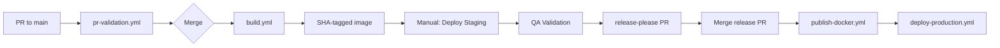

# 6.a Deployment & Operations

Created by: Abe Caymo
Created time: February 18, 2025 5:24 PM
Category: Engineering, Strategy doc
Last edited by: Document Review Panel
Last updated time: January 15, 2026

# **Deployment & Operations Guide**

_Aptivo Agentic Platform_

_v2.1.0 – [February 3, 2026]_

_Aligned with: TSD v3.0.0, ADD v2.0.0, Coding Guidelines v3.0.0, Testing Strategies v2.0.0_

---

## **1. Introduction**

### 1.1 Purpose

This document is the central operational runbook for Aptivo. It defines the standard operating procedures (SOPs) for deployment, monitoring, maintenance, and incident response.

### 1.2 Scope

This guide covers the operational lifecycle of all modules and shared services. Adherence to these procedures is mandatory for maintaining system stability and security.

### 1.3 Audience

- DevOps Engineers
- System Administrators
- Operations Teams
- On-Call Support Staff
- Site Reliability Engineers (SRE)

### 1.4 Related Documents

- **TSD v3.0.0** - Technical specifications, health checks, feature flags
- **ADD v2.0.0** - Architecture, HA/DR requirements (RTO/RPO targets)
- **Coding Guidelines v3.0.0** - OpenTelemetry, RFC 7807, Result types
- **Testing Strategies v2.0.0** - CI/CD pipeline, security scans, performance targets
- **[05d-Observability.md](../05-guidelines/05d-Observability.md)** - Detailed observability architecture

---

## **2. Deployment Process**

### 2.1 Deployment Strategy

The system uses a container-based deployment model with progressive delivery:

| Component            | Strategy                           | Rollback Time |
| -------------------- | ---------------------------------- | ------------- |
| Application Services | Blue-Green / Canary                | < 5 minutes   |
| Database Migrations  | Forward-only with rollback scripts | < 15 minutes  |
| Feature Releases     | Feature flags (instant toggle)     | Immediate     |

### 2.2 Environments (Trunk-Based Development)

> **Strategy**: Build Once, Deploy Many. A single SHA-tagged artifact progresses through environments.

| Environment     | Source     | Trigger             | Purpose                                        |
| --------------- | ---------- | ------------------- | ---------------------------------------------- |
| **Development** | any branch | Local Docker        | Local developer environments                   |
| **Preview**     | any branch | Manual dispatch     | Stakeholder demos from any branch              |
| **Staging**     | main SHA   | Manual dispatch     | Production-like testing of validated artifacts |
| **Production**  | main tag   | Version tag push    | Live environment via release-please            |

**Artifact Flow**:
```
PR → pr-validation.yml → Merge → build.yml → SHA-tagged image
                                      ↓
                              Manual: Deploy Staging
                                      ↓
                              QA Validation
                                      ↓
                              release-please PR → Merge → Production
```

### 2.3 Standard Deployment Checklist

#### Pre-Deployment Gates

- [ ] All CI/CD pipeline checks passed:
  - [ ] Lint & format (ESLint flat config, Prettier)
  - [ ] Type check (TypeScript strict mode)
  - [ ] Unit tests with tiered coverage (Domain 100%, Application 80%, Interface 60%)
  - [ ] Integration tests passed
  - [ ] Security scans passed:
    - [ ] SAST (eslint-plugin-security) - Implementing
    - [ ] SCA (pnpm audit --audit-level=critical)
    - [ ] Secrets scanning (gitleaks)
    - [ ] Container image scanning (Trivy)
  - [ ] SBOM generated (BuildKit attestation)
- [ ] Performance tests confirm P95 response time < 500ms
- [ ] E2E test suite passed against staging (> 98% pass rate)
- [ ] QA sign-off obtained
- [ ] Change request approved (see 05d-Change-Risk-Management.md)

#### Deployment Steps

- [ ] Create version tag in Git (e.g., `v1.2.0`)
- [ ] Verify feature flags are configured for gradual rollout
- [ ] Trigger "Deploy to Production" workflow in GitHub Actions
- [ ] Monitor deployment progress via:
  - [ ] GitHub Actions logs
  - [ ] DigitalOcean App Platform dashboard
  - [ ] OpenTelemetry traces for deployment spans
- [ ] Verify health check endpoints return healthy status:
  - [ ] `/health/live` - Liveness probe
  - [ ] `/health/ready` - Readiness probe
- [ ] Perform post-deployment smoke tests on critical endpoints
- [ ] Monitor error rates and latency for 15 minutes post-deploy
- [ ] Announce deployment completion in #ops-deployments channel

#### Post-Deployment Validation

- [ ] Confirm all containers are running (DO App Platform dashboard)
- [ ] Verify no spike in error rates (Sentry, OpenTelemetry)
- [ ] Check P95 response times remain < 500ms
- [ ] Validate feature flags are functioning correctly

### 2.4 Feature Flag Management

Feature flags enable safe, incremental rollouts and instant rollback without code deployment.

#### Flag Lifecycle

```
Created → Staging Test → Gradual Rollout → Full Release → Cleanup
```

#### Rollout Strategy

| Phase    | Audience        | Duration | Success Criteria            |
| -------- | --------------- | -------- | --------------------------- |
| Canary   | 1% of traffic   | 1 hour   | No error spike, P95 < 500ms |
| Limited  | 10% of traffic  | 4 hours  | Error rate < 0.1%           |
| Expanded | 50% of traffic  | 24 hours | No degradation              |
| Full     | 100% of traffic | -        | Stable for 1 week           |

#### Flag Operations

```bash
# enable feature for percentage of users
aptivo-cli feature enable user-dashboard-v2 --percent 10

# disable feature immediately (emergency)
aptivo-cli feature disable user-dashboard-v2 --immediate

# check flag status
aptivo-cli feature status user-dashboard-v2
```

---

## **3. Infrastructure Architecture**

> **Multi-Model Consensus (2026-02-03)**: DigitalOcean App Platform selected over Kubernetes. K8s operational overhead is not justified for a 3-developer, self-funded team. See ADD Section 10.3 for rationale and upgrade triggers.

### 3.1 Production Architecture (DigitalOcean App Platform)

```
┌─────────────────────────────────────────────────────────────────┐
│                   DigitalOcean App Platform                      │
│  ┌───────────────────────────────────────────────────────────┐  │
│  │                    Load Balancer (managed)                 │  │
│  │                    TLS termination, routing                │  │
│  └─────────────────────────┬─────────────────────────────────┘  │
│                            │                                     │
│  ┌─────────────────────────▼─────────────────────────────────┐  │
│  │                    App Service                             │  │
│  │  ┌─────────────┐  ┌─────────────┐  ┌─────────────┐        │  │
│  │  │ Container 1 │  │ Container 2 │  │ Container N │        │  │
│  │  │ (auto-scale)│  │ (auto-scale)│  │ (auto-scale)│        │  │
│  │  └─────────────┘  └─────────────┘  └─────────────┘        │  │
│  │  Health checks: /health/live, /health/ready               │  │
│  └───────────────────────────────────────────────────────────┘  │
└─────────────────────────────────────────────────────────────────┘
                            │
        ┌───────────────────┼───────────────────┐
        ▼                   ▼                   ▼
┌───────────────┐   ┌───────────────┐   ┌───────────────┐
│  PostgreSQL   │   │    Redis      │   │ DigitalOcean  │
│  (DO Managed) │   │  (DO Managed) │   │    Spaces     │
│               │   │               │   │ (S3-compat)   │
└───────────────┘   └───────────────┘   └───────────────┘
```

### 3.2 Resource Specifications

| Service            | Size          | Scaling           | Notes                                 |
| ------------------ | ------------- | ----------------- | ------------------------------------- |
| **App Service**    | Basic ($12/mo)| 1-3 containers    | CPU/memory auto-scale                 |
| **PostgreSQL**     | Basic ($15/mo)| Vertical          | DO Managed Database                   |
| **Redis**          | Basic ($15/mo)| Single node       | DO Managed Redis                      |
| **Spaces**         | $5/mo + usage | N/A               | S3-compatible object storage          |

**Cost Estimate**: ~$50-100/mo for staging + production (vs. $200-400/mo for managed K8s)

### 3.3 App Platform Configuration

```yaml
# .do/app.yaml
name: aptivo
region: nyc
services:
  - name: api
    github:
      repo: aptivo/aptivo-final-v2
      branch: main
      deploy_on_push: false  # manual promotion from staging
    dockerfile_path: Dockerfile
    instance_count: 2
    instance_size_slug: basic-xxs
    http_port: 8080
    health_check:
      http_path: /health/live
      initial_delay_seconds: 10
      period_seconds: 10
    envs:
      - key: NODE_ENV
        value: production
      - key: DATABASE_URL
        scope: RUN_TIME
        type: SECRET
      - key: REDIS_URL
        scope: RUN_TIME
        type: SECRET

databases:
  - name: aptivo-db
    engine: PG
    version: "16"
    size: db-s-1vcpu-1gb

  - name: aptivo-redis
    engine: REDIS
    version: "7"
    size: db-s-1vcpu-1gb
```

### 3.4 K8s Upgrade Triggers

**Current Decision**: DigitalOcean App Platform (PaaS)

**When to Reconsider Kubernetes** (document these criteria explicitly):

| Trigger | Threshold | Rationale |
|---------|-----------|-----------|
| Custom networking/sidecars required | Service mesh, custom ingress | PaaS cannot accommodate |
| Fine-grained autoscaling | Beyond CPU/memory metrics | K8s HPA with custom metrics |
| Multi-tenant isolation | Compliance mandates | K8s namespace isolation |
| Cost inflection | PaaS > K8s + ops overhead | ~$500/mo+ with dedicated ops |
| Team growth | 5+ engineers with K8s experience | Can absorb operational burden |

**Not Triggers**:
- "We might need it someday" - YAGNI
- "Other companies use K8s" - Different scale/team
- "It looks more professional" - Premature optimization

---

## **4. Configuration Management**

### 4.1 Environment Validation

All services must use `@t3-oss/env-nextjs` for type-safe environment validation. Services fail fast on startup if configuration is invalid.

```typescript
// lib/env.ts
import { createEnv } from "@t3-oss/env-nextjs";
import { z } from "zod";

export const env = createEnv({
  server: {
    NODE_ENV: z.enum(["development", "staging", "production"]),
    DATABASE_URL: z.string().url(),
    DATABASE_POOL_MAX: z.coerce.number().int().min(1).max(100).default(20),
    REDIS_URL: z.string().url(),
    NATS_URL: z.string().url(),
    AUTH_ISSUER: z.string().url(),
    AUTH_SECRET: z.string().min(32),
    OTEL_EXPORTER_OTLP_ENDPOINT: z.string().url(),
    SENTRY_DSN: z.string().url(),
    FEATURE_FLAG_API_KEY: z.string().min(1),
  },
  client: {
    NEXT_PUBLIC_APP_URL: z.string().url(),
    NEXT_PUBLIC_SENTRY_DSN: z.string().url(),
  },
  // fail build if validation fails
  skipValidation: false,
  // throw on missing vars in production
  emptyStringAsUndefined: true,
});
```

### 4.2 Configuration Hierarchy

Priority order (highest to lowest):

1. App Platform encrypted environment variables (for sensitive values)
2. App Platform environment variables (for non-sensitive config)
3. Environment variables in container spec
4. `.env` file (development only)

### 4.3 Secrets Management

All secrets managed via DigitalOcean App Platform encrypted environment variables:

| Secret Type          | Storage                            | Rotation              |
| -------------------- | ---------------------------------- | --------------------- |
| Database credentials | DO App Platform (encrypted)        | 90 days               |
| API keys             | DO App Platform (encrypted)        | 90 days               |
| JWT signing keys     | DO App Platform (encrypted)        | 180 days              |
| TLS certificates     | DO Managed (auto-renewal)          | Automatic             |

```bash
# example: update secret via doctl CLI
doctl apps update-env <app-id> --env DATABASE_URL=<new-value> --type SECRET

# or via GitHub Actions with DIGITALOCEAN_ACCESS_TOKEN
# secrets are never stored in git
```

---

## **5. Observability & Monitoring**

### 5.1 OpenTelemetry Architecture

All services emit telemetry via OpenTelemetry SDK with direct OTLP export (App Platform compatible).

```
┌─────────────┐                         ┌─────────────┐
│ Application │────── OTLP/HTTP ───────▶│   Backend   │
│   (SDK)     │                         │  (Grafana   │
│             │                         │   Cloud /   │
│ OTel SDK    │                         │  Honeycomb) │
└─────────────┘                         └─────────────┘
      │
      │  Traces, Metrics, Logs (direct export)
      └────────────────────────────────────────
```

> **Note**: App Platform does not support sidecars. Services export directly to observability backend via OTLP/HTTP.

### 5.2 Key Metrics & Alerts

| Metric                       | Tool            | Threshold          | Alert             | Recipient       |
| ---------------------------- | --------------- | ------------------ | ----------------- | --------------- |
| **API P95 Response Time**    | Prometheus/OTel | > 500ms for 5 min  | PagerDuty P2      | On-Call SRE     |
| **HTTP 5xx Error Rate**      | Prometheus/OTel | > 1% over 5 min    | PagerDuty P1      | On-Call SRE     |
| **HTTP 4xx Error Rate**      | Prometheus/OTel | > 5% over 10 min   | Slack #ops-alerts | DevOps Team     |
| **CPU Utilization**          | Prometheus      | > 80% for 10 min   | Slack #ops-alerts | DevOps Team     |
| **Memory Utilization**       | Prometheus      | > 85% for 10 min   | PagerDuty P2      | On-Call SRE     |
| **Database Connections**     | Prometheus      | > 80% of max       | PagerDuty P2      | On-Call SRE     |
| **Database Replication Lag** | Prometheus      | > 30 seconds       | PagerDuty P1      | On-Call SRE     |
| **Health Check Failures**    | App Platform    | Container unhealthy 3x | PagerDuty P1  | On-Call SRE     |
| **Application Errors**       | Sentry/OTel     | New error type     | Slack #ops-errors | On-Call Support |
| **Feature Flag Errors**      | Custom metric   | Any toggle failure | Slack #ops-alerts | DevOps Team     |

### 5.3 Health Check Endpoints

All services expose standardized health endpoints:

| Endpoint          | Purpose                                  | Response          |
| ----------------- | ---------------------------------------- | ----------------- |
| `/health/live`    | Liveness probe (is process running?)     | `200 OK` or `503` |
| `/health/ready`   | Readiness probe (can accept traffic?)    | `200 OK` or `503` |
| `/health/startup` | Startup probe (initialization complete?) | `200 OK` or `503` |

```typescript
// health check response format
interface HealthResponse {
  status: "healthy" | "degraded" | "unhealthy";
  checks: {
    database: "up" | "down";
    redis: "up" | "down";
    nats: "up" | "down";
  };
  version: string;
  uptime: number;
}
```

### 5.4 Log Management

#### Structured Logging Format

All logs must be structured JSON with OpenTelemetry correlation:

```json
{
  "timestamp": "2026-01-15T10:30:00.000Z",
  "level": "error",
  "message": "Failed to process candidate",
  "service": "aptivo-app",
  "version": "1.2.0",
  "environment": "production",
  "traceId": "abc123def456",
  "spanId": "789ghi",
  "error": {
    "type": "https://api.aptivo.com/errors/persistence-error",
    "title": "Database Error",
    "status": 500
  }
}
```

#### Log Aggregation

- **Collection:** App Platform built-in log forwarding
- **Storage:** Elasticsearch / Loki
- **Visualization:** Grafana dashboards
- **Retention:** 30 days (hot), 90 days (warm), 1 year (cold/archived)

### 5.5 Error Reporting with RFC 7807

All API errors use RFC 7807 Problem Details format. Operations should leverage this for precise alerting:

```typescript
// RFC 7807 Problem Details structure
interface ProblemDetails {
  type: string; // URI identifying error type
  title: string; // human-readable summary
  status: number; // HTTP status code
  detail?: string; // explanation
  instance?: string; // URI for this occurrence
  traceId?: string; // OpenTelemetry trace ID
  errors?: Array<{
    // validation errors
    field: string;
    message: string;
  }>;
}
```

#### Alert Routing by Error Type

Configure alerts based on RFC 7807 `type` field for precise incident routing:

| Error Type URI                  | Severity | Action             |
| ------------------------------- | -------- | ------------------ |
| `/errors/database-unavailable`  | P1       | Page DBA + SRE     |
| `/errors/authentication-failed` | P2       | Page Security      |
| `/errors/rate-limit-exceeded`   | P3       | Slack notification |
| `/errors/validation-error`      | P4       | Log only           |

#### Result-Based Error Reporting

Since the application uses functional error handling with `Result<T, E>` types, operations teams must understand that errors may not throw exceptions. All services must explicitly capture and report `Result.Err` values:

```typescript
// handler pattern: always report Result errors to Sentry
import * as Sentry from "@sentry/nextjs";
import { mapErrorToHttpResponse } from "@/lib/errors/http-mapper";

export async function handleRequest(input: Input): Promise<Response> {
  const result = await processBusinessLogic(input);

  if (!result.success) {
    // mandatory: capture functional errors in Sentry
    Sentry.captureException(result.error, {
      tags: {
        errorType: result.error._tag,
        operation: "processBusinessLogic",
      },
      extra: {
        input: sanitizeForLogging(input),
      },
    });

    // map Result error to RFC 7807 HTTP response
    return mapErrorToHttpResponse(result.error);
  }

  return Response.json(result.value);
}
```

#### Result Error Metrics

Track `Result.Err` occurrences as Prometheus metrics for operational visibility:

```typescript
// example custom metrics for Result-based errors
import { Counter } from "prom-client";

const resultErrorCounter = new Counter({
  name: "aptivo_result_errors_total",
  help: "Total count of Result.Err occurrences",
  labelNames: ["operation", "error_tag", "module"],
});

// usage in error handling
if (!result.success) {
  resultErrorCounter.inc({
    operation: "createProject",
    error_tag: result.error._tag,
    module: "project-management",
  });
}

// example metrics produced:
// aptivo_result_errors_total{operation="createProject",error_tag="ValidationError",module="project-management"} 42
// aptivo_result_errors_total{operation="findCandidate",error_tag="NotFoundError",module="recruitment"} 7
```

**Key Operational Points:**

- **Never silently discard** `Result.Err` values - they represent real failures
- **Always capture** errors in Sentry even when the code doesn't throw
- **Emit metrics** for all Result failures to enable alerting
- **Map consistently** to RFC 7807 responses for API consumers
- **Include trace context** via OpenTelemetry for correlation

### 5.6 Operational Tooling

For running ad-hoc scripts or debugging production issues:

```bash
# run operational task with full DI container
pnpm run task -- <task-name>

# examples
pnpm run task -- migrate-data
pnpm run task -- reprocess-failed-events
pnpm run task -- generate-report --date 2026-01-15

# all operational scripts use same dependency injection pattern
# and emit OpenTelemetry traces for observability
```

---

## **6. CI/CD Pipeline**

### 6.1 Pipeline Architecture

> **Strategy**: Build Once, Deploy Many with SHA-tagged immutable artifacts.



**Workflow Files**:

| Workflow | Trigger | Purpose |
|----------|---------|---------|
| `pr-validation.yml` | PR to main | Lint, typecheck, unit tests, security scans |
| `build.yml` | Push to main | Build SHA-tagged Docker image, container scan |
| `publish-docker.yml` | Version tag | Retag SHA image with version, publish |
| `deploy-production.yml` | After publish | Deploy to production via DO App Platform |

### 6.2 Security Scan Requirements

| Scan Type     | Tool                     | Status         | Failure Threshold   | Frequency            |
| ------------- | ------------------------ | -------------- | ------------------- | -------------------- |
| **SAST**      | eslint-plugin-security   | Implementing   | Any high/critical   | Every PR             |
| **SCA**       | pnpm audit               | Active         | Critical only       | Every PR             |
| **Secrets**   | gitleaks                 | Active         | Any detected secret | Every PR             |
| **Container** | Trivy (v0.28.0)          | Active         | Critical/High CVE   | Before registry push |
| **SBOM**      | BuildKit attestation     | Active         | Generate always     | Every release        |

### 6.3 Deployment Gates

| Gate                  | Criteria                                       | Enforced By              |
| --------------------- | ---------------------------------------------- | ------------------------ |
| **PR Merge**          | All checks pass, coverage met, 1+ approval     | GitHub Branch Protection |
| **Staging Deploy**    | All tests pass, no critical security findings  | GitHub Actions           |
| **Production Deploy** | QA sign-off, change request approved, E2E pass | Manual + GitHub Actions  |

---

## **7. Maintenance SOPs**

### 7.1 Daily Tasks

- [ ] Review Sentry for new application errors (last 24 hours)
- [ ] Check Grafana dashboards for performance anomalies
- [ ] Verify all health checks are passing
- [ ] Review OpenTelemetry traces for high-latency operations

### 7.2 Weekly Tasks

- [ ] Review audit logs for suspicious activity
- [ ] Apply security patches to container base images
- [ ] Run SCA scan and review new vulnerabilities
- [ ] Test feature flag toggles in staging
- [ ] Review and clean up old feature flags (> 30 days enabled)

### 7.3 Monthly Tasks

- [ ] Conduct full review of system access logs
- [ ] Test database backup recovery in non-production environment
- [ ] Test disaster recovery runbook (dry run)
- [ ] Review and rotate secrets approaching expiry
- [ ] Capacity planning review based on growth trends

### 7.4 Quarterly Tasks

- [ ] Full DR failover test to secondary region
- [ ] Penetration testing engagement
- [ ] Review and update runbooks
- [ ] Chaos engineering exercises

---

## **8. Incident Response**

### 8.1 Severity Classification

| Severity  | Definition                              | Response Time | Resolution Target |
| --------- | --------------------------------------- | ------------- | ----------------- |
| **SEV-1** | Complete outage, data loss risk         | 5 minutes     | 1 hour            |
| **SEV-2** | Major degradation, > 50% users affected | 15 minutes    | 4 hours           |
| **SEV-3** | Minor degradation, < 50% users affected | 1 hour        | 24 hours          |
| **SEV-4** | Cosmetic issues, workaround available   | 4 hours       | 1 week            |

### 8.2 On-Call Rotation

| Role                    | Schedule                 | Escalation Path                  |
| ----------------------- | ------------------------ | -------------------------------- |
| **Primary On-Call**     | Weekly rotation          | PagerDuty → Phone                |
| **Secondary On-Call**   | Weekly rotation (backup) | PagerDuty → Phone (after 10 min) |
| **Engineering Manager** | Always available         | Manual escalation for SEV-1      |

### 8.3 Incident Response Process

```
Alert Received
      │
      ▼
┌─────────────┐
│ Acknowledge │ (within response time)
│   Alert     │
└──────┬──────┘
       │
       ▼
┌─────────────┐
│   Assess    │ Determine severity, affected systems
│   Impact    │
└──────┬──────┘
       │
       ▼
┌─────────────┐
│ Communicate │ Post to #incident-{id} channel
│   Status    │
└──────┬──────┘
       │
       ▼
┌─────────────┐
│  Mitigate   │ Feature flag disable, rollback, scale
│   Impact    │
└──────┬──────┘
       │
       ▼
┌─────────────┐
│   Resolve   │ Fix root cause or implement workaround
│   Issue     │
└──────┬──────┘
       │
       ▼
┌─────────────┐
│ Post-Mortem │ Blameless review within 48 hours
│   Review    │
└─────────────┘
```

### 8.4 Playbook 1: Failed Deployment Rollback

**Trigger:** Deploy fails or smoke tests reveal critical issues

**Immediate Actions (< 5 minutes):**

1. **Disable feature flags** for new functionality (instant)
2. **Trigger rollback** via GitHub Actions "Rollback Production" workflow
3. **Post status** in #ops-deployments: "🔴 Production rollback initiated"

**Verification:**

1. Confirm previous stable version is running
2. Re-run smoke tests
3. Monitor error rates for 15 minutes

**Post-Incident:**

1. Announce recovery in #ops-deployments
2. Create incident ticket for post-mortem
3. Do not re-deploy until root cause identified

### 8.5 Playbook 2: Database Outage

**Trigger:** Database unreachable alert or replication lag > 5 minutes

**Immediate Actions:**

1. **Check managed service status** (RDS/CloudSQL dashboard)
2. **Assess scope:** Primary failure vs replication issue
3. **Page DBA** if not already notified

**Automated Failover (if enabled):**

- Managed database services handle automatic failover
- Application reconnects automatically via connection pooler

**Manual Failover (if required):**

1. Promote standby to primary
2. Update connection strings (via App Platform encrypted env vars)
3. Redeploy application to pick up new connection

**Recovery Validation:**

1. Verify database connectivity from all services
2. Check replication is re-established
3. Verify no data loss (compare transaction logs)

### 8.6 Playbook 3: Regional Disaster Recovery

**Trigger:** Complete regional outage or declared disaster

**RTO Target:** < 4 hours
**RPO Target:** < 1 hour

**Pre-Requisites:**

- [ ] Secondary region infrastructure provisioned
- [ ] Database replication to secondary region active
- [ ] DNS failover configured (Route53/CloudFlare)
- [ ] Runbook tested quarterly

**Recovery Steps:**

1. **Declare disaster** - Notify management, create incident channel
2. **Verify secondary region** - Confirm infrastructure is healthy
3. **Promote database replica** - Make secondary region primary
4. **Update DNS** - Point traffic to secondary region
5. **Verify services** - Run smoke tests against secondary
6. **Communicate** - Update status page, notify stakeholders
7. **Monitor** - Watch for issues in new primary region

**Failback Process (after primary recovery):**

1. Re-establish replication from new primary to original region
2. Plan maintenance window for failback
3. Execute reverse of recovery steps
4. Update runbook with lessons learned

---

## **9. Infrastructure as Code**

### 9.1 App Spec Workflow

Infrastructure changes follow App Spec-based GitOps:

```
Developer PR (.do/app.yaml) → Review → Merge → GitHub Actions → doctl apps update
```

### 9.2 Infrastructure Repository Structure

```
.do/
├── app.yaml              # Main app specification
├── app.staging.yaml      # Staging overrides (optional)
└── README.md             # Infrastructure documentation

.github/workflows/
├── pr-validation.yml     # PR checks
├── build.yml             # Build SHA-tagged images
├── deploy-staging.yml    # Manual staging deploy
├── publish-docker.yml    # Tag release images
└── deploy-production.yml # Production deploy
```

### 9.3 Configuration Management

App Platform configuration is version-controlled in `.do/app.yaml`:

```bash
# validate app spec
doctl apps spec validate .do/app.yaml

# apply changes (via GitHub Actions, not manual)
doctl apps update <app-id> --spec .do/app.yaml

# view current deployment
doctl apps list-deployments <app-id>
```

Changes to infrastructure trigger PR review process before deployment.

---

## **10. Roles & Responsibilities (RACI Matrix)**

| Task                            | DevOps       | SRE          | Development | Management |
| ------------------------------- | ------------ | ------------ | ----------- | ---------- |
| **New Deployments**             | **R**        | C            | C           | **I**      |
| **System Monitoring**           | C            | **R**, **A** | I           | **I**      |
| **Incident Response (SEV-3/4)** | C            | **R**        | C           | **I**      |
| **Incident Response (SEV-1/2)** | **R**        | **R**, **A** | C           | **C**      |
| **Backup & Recovery**           | **R**, **A** | C            | I           | **I**      |
| **Maintenance & Patching**      | **R**, **A** | C            | I           | **A**      |
| **Security Compliance**         | C            | **A**        | C           | **R**      |
| **Capacity Planning**           | C            | **R**        | C           | **A**      |
| **DR Testing**                  | **R**        | **R**, **A** | I           | **I**      |
| **Post-Mortem Reviews**         | C            | **R**        | **R**       | **A**      |

**Legend:**

- **R** = Responsible (does the work)
- **A** = Accountable (final decision maker)
- **C** = Consulted (provides input)
- **I** = Informed (kept updated)

---

## **Revision History**

| Version | Date       | Author                | Changes                                                                                                                                                                                                |
| ------- | ---------- | --------------------- | ------------------------------------------------------------------------------------------------------------------------------------------------------------------------------------------------------ |
| v1.0.0  | 2025-02-18 | Abe Caymo             | Initial version                                                                                                                                                                                        |
| v1.0.1  | 2025-06-04 | Abe Caymo             | Added Result-based error reporting section                                                                                                                                                             |
| v2.0.0  | 2026-01-15 | Document Review Panel | Major rewrite: aligned with TSD v3.0.0, ADD v2.0.0; added OpenTelemetry, health checks, feature flags, container orchestration (K8s), RFC 7807 operations, severity model, RTO/RPO targets, GitOps/IaC |
| v2.1.0  | 2026-02-03 | Multi-Model Consensus | Aligned with ADD: replaced K8s with DigitalOcean App Platform, TBD environments, Build Once Deploy Many pipeline, added security scan status |
