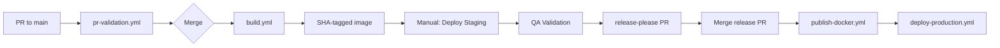

# 6.a Deployment & Operations

Created by: Abe Caymo
Created time: February 18, 2025 5:24 PM
Category: Engineering, Strategy doc
Last edited by: Document Review Panel
Last updated time: January 15, 2026

# **Deployment & Operations Guide**

_Aptivo Agentic Platform_

_v2.2.0 – [March 4, 2026]_

_Aligned with: TSD v3.0.0, ADD v2.0.0, Coding Guidelines v3.0.0, Testing Strategies v2.0.0_

---

## **1. Introduction**

### 1.1 Purpose

This document is the central operational runbook for Aptivo. It defines the standard operating procedures (SOPs) for deployment, monitoring, maintenance, and incident response.

### 1.2 Scope

This guide covers the operational lifecycle of all modules and shared services. Adherence to these procedures is mandatory for maintaining system stability and security.

### 1.3 Audience

- DevOps Engineers
- System Administrators
- Operations Teams
- On-Call Support Staff
- Site Reliability Engineers (SRE)

### 1.4 Related Documents

- **TSD v3.0.0** - Technical specifications, health checks, feature flags
- **ADD v2.0.0** - Architecture, HA/DR requirements (RTO/RPO targets)
- **Coding Guidelines v3.0.0** - OpenTelemetry, RFC 7807, Result types
- **Testing Strategies v2.0.0** - CI/CD pipeline, security scans, performance targets
- **[05d-Observability.md](../05-guidelines/05d-Observability.md)** - Detailed observability architecture

---

## **2. Deployment Process**

### 2.1 Deployment Strategy

The system uses a container-based deployment model with progressive delivery:

| Component            | Strategy                                          | Rollback Time |
| -------------------- | ------------------------------------------------- | ------------- |
| Application Services | Rolling deploy with instant rollback (DO App Platform) | < 5 minutes   |
| Database Migrations  | Forward-only with rollback scripts                | < 15 minutes  |
| Feature Releases     | Compile-time feature flags with env var escape hatches | Per-deploy    |
| Gradual Rollout      | Deployment-gated rollout via environment promotion | Per-deploy    |

> **Note**: Phase 1 feature flags are compile-time constants toggled via environment variables and deployment-gated rollouts — NOT a runtime feature flag service. See Section 2.4 for details. Percentage-based canary traffic splitting requires Kubernetes + service mesh (not available on DO App Platform).

### 2.2 Environments (Trunk-Based Development)

> **Strategy**: Build Once, Deploy Many. A single SHA-tagged artifact progresses through environments.

| Environment     | Source     | Trigger             | Purpose                                        |
| --------------- | ---------- | ------------------- | ---------------------------------------------- |
| **Development** | any branch | Local Docker        | Local developer environments                   |
| **Preview**     | any branch | Manual dispatch     | Stakeholder demos from any branch              |
| **Staging**     | main SHA   | Manual dispatch     | Production-like testing of validated artifacts |
| **Production**  | main tag   | Version tag push    | Live environment via release-please            |

**Artifact Flow**:
```
PR → pr-validation.yml → Merge → build.yml → SHA-tagged image
                                      ↓
                              Manual: Deploy Staging
                                      ↓
                              QA Validation
                                      ↓
                              release-please PR → Merge → Production
```

### 2.3 Standard Deployment Checklist

#### Pre-Deployment Gates

- [ ] All CI/CD pipeline checks passed:
  - [ ] Lint & format (ESLint flat config, Prettier)
  - [ ] Type check (TypeScript strict mode)
  - [ ] Unit tests with tiered coverage (Domain 100%, Application 80%, Interface 60%)
  - [ ] Integration tests passed
  - [ ] Security scans passed:
    - [ ] SAST (eslint-plugin-security) - Implementing
    - [ ] SCA (pnpm audit --audit-level=critical)
    - [ ] Secrets scanning (gitleaks)
    - [ ] Container image scanning (Trivy)
  - [ ] SBOM generated (BuildKit attestation)
- [ ] Performance tests confirm P95 response time < 500ms
- [ ] E2E test suite passed against staging (> 98% pass rate)
- [ ] QA sign-off obtained
- [ ] Change request approved (see 05d-Change-Risk-Management.md)

#### Deployment Steps

- [ ] Create version tag in Git (e.g., `v1.2.0`)
- [ ] Verify feature flags are configured for gradual rollout
- [ ] Trigger "Deploy to Production" workflow in GitHub Actions
- [ ] Monitor deployment progress via:
  - [ ] GitHub Actions logs
  - [ ] DigitalOcean App Platform dashboard
  - [ ] OpenTelemetry traces for deployment spans
- [ ] Verify health check endpoints return healthy status:
  - [ ] `/health/live` - Liveness probe
  - [ ] `/health/ready` - Readiness probe
- [ ] Perform post-deployment smoke tests on critical endpoints
- [ ] Monitor error rates and latency for 15 minutes post-deploy
- [ ] Announce deployment completion in #ops-deployments channel

#### Post-Deployment Validation

- [ ] Confirm all containers are running (DO App Platform dashboard)
- [ ] Verify no spike in error rates (Sentry, OpenTelemetry)
- [ ] Check P95 response times remain < 500ms
- [ ] Validate feature flags are functioning correctly

### 2.4 Feature Flag Management

> **Phase 1 Reality**: Feature flags are **compile-time constants with environment variable escape hatches** — NOT a runtime feature flag service. "Feature flag management" means toggling environment variables and performing deployment-gated rollouts. There is no percentage-based traffic splitting, no runtime toggle UI, and no gradual rollout within a single deployment.
>
> A dedicated feature flag service (LaunchDarkly, Unleash, etc.) is a Phase 2+ consideration if runtime percentage rollouts are needed without redeployment.
>
> See [`docs/04-specs/configuration.md` §5](../04-specs/configuration.md#5-feature-flags) for implementation details.

#### Flag Lifecycle

```
Defined in code → Env var override (optional) → Deploy to staging → Validate → Deploy to production → Remove flag (cleanup)
```

#### Rollout Strategy (Deployment-Gated)

| Phase       | Mechanism                                 | Duration | Success Criteria            |
| ----------- | ----------------------------------------- | -------- | --------------------------- |
| Development | Flag enabled in `.env` locally            | -        | Unit/integration tests pass |
| Staging     | Flag enabled via env var in staging deploy | 1–2 days | QA sign-off                 |
| Production  | Flag enabled via env var in production deploy | -     | Error rate < 0.1%, P95 < 500ms |
| Cleanup     | Remove flag constant and conditional code | 1 sprint | Code simplified             |

#### Flag Operations

```bash
# enable a feature flag via environment variable (requires redeployment)
doctl apps update <app-id> --spec .do/app.yaml
# where app.yaml includes: FEATURE_USER_DASHBOARD_V2=true

# disable a feature flag (requires redeployment)
# set FEATURE_USER_DASHBOARD_V2=false in app spec and redeploy

# emergency disable: set env var to false and trigger immediate redeploy
doctl apps create-deployment <app-id> --force-rebuild
```

> **Important**: Because flags require redeployment to change, "instant rollback" via flag toggle is not available in Phase 1. Emergency rollback uses application rollback (§9.1) or env var change + redeploy.

---

## **3. Infrastructure Architecture**

> **Multi-Model Consensus (2026-02-03)**: DigitalOcean App Platform selected over Kubernetes. K8s operational overhead is not justified for a 3-developer, self-funded team. See ADD Section 10.3 for rationale and upgrade triggers.

### 3.1 Production Architecture (DigitalOcean App Platform)

```
┌─────────────────────────────────────────────────────────────────┐
│                   DigitalOcean App Platform                      │
│  ┌───────────────────────────────────────────────────────────┐  │
│  │                    Load Balancer (managed)                 │  │
│  │                    TLS termination, routing                │  │
│  └─────────────────────────┬─────────────────────────────────┘  │
│                            │                                     │
│  ┌─────────────────────────▼─────────────────────────────────┐  │
│  │                    App Service                             │  │
│  │  ┌─────────────┐  ┌─────────────┐  ┌─────────────┐        │  │
│  │  │ Container 1 │  │ Container 2 │  │ Container N │        │  │
│  │  │ (auto-scale)│  │ (auto-scale)│  │ (auto-scale)│        │  │
│  │  └─────────────┘  └─────────────┘  └─────────────┘        │  │
│  │  Health checks: /health/live, /health/ready               │  │
│  └───────────────────────────────────────────────────────────┘  │
└─────────────────────────────────────────────────────────────────┘
                            │
        ┌───────────────────┼───────────────────┐
        ▼                   ▼                   ▼
┌───────────────┐   ┌───────────────┐   ┌───────────────┐
│  PostgreSQL   │   │    Redis      │   │ DigitalOcean  │
│  (DO Managed) │   │  (DO Managed) │   │    Spaces     │
│               │   │               │   │ (S3-compat)   │
└───────────────┘   └───────────────┘   └───────────────┘
```

### 3.2 Resource Specifications

| Service            | Size          | Scaling           | Notes                                 |
| ------------------ | ------------- | ----------------- | ------------------------------------- |
| **App Service**    | Basic ($12/mo)| 1-3 containers    | CPU/memory auto-scale                 |
| **PostgreSQL**     | Basic ($15/mo)| Vertical          | DO Managed Database                   |
| **Redis**          | Basic ($15/mo)| Single node       | DO Managed Redis                      |
| **Spaces**         | $5/mo + usage | N/A               | S3-compatible object storage          |
| **ClamAV**         | ~$6/mo        | Single container  | Malware scanning (see ADD §9.8.2); runs as DO App Platform worker or external Docker service |

**Cost Estimate**: ~$55-110/mo for staging + production (vs. $200-400/mo for managed K8s)

#### 3.2.1 Cost Controls and Budget Caps

| Resource | Monthly Budget | Alert Threshold | Exceed Behavior | Cost Attribution |
|----------|---------------|-----------------|-----------------|------------------|
| **App Service (auto-scale)** | $50/mo | DigitalOcean billing alert at $40 (80%) | Max 3 containers (hard cap in app spec); alert on-call if sustained at max | Platform — shared infrastructure |
| **PostgreSQL** | $25/mo | DO billing alert at $20 | Vertical scaling requires manual approval | Platform — shared infrastructure |
| **Redis** | $20/mo | DO billing alert at $15 | Single node (no auto-scale); alert on memory > 80% | Platform — shared infrastructure |
| **Spaces** | $15/mo | DO billing alert at $12 | Storage growth alert; review file retention policies | Platform — shared infrastructure |
| **ClamAV** | $10/mo | N/A (fixed cost) | Fixed container | Platform — security |
| **LLM API** | $500/mo (all domains) | Application-level at 90% (ADD §7.2) | Hard cap per domain (daily $50, monthly $500) | Per-domain attribution (ADD §7.2) |
| **Novu** | Free tier (10K events/mo) | Application-level at 8K events | No fallback provider (accepted risk — ADD §10.4.4); alert ops; manual intervention | Platform — notifications |
| **Inngest** | Free tier (Phase 1) | Monitor function run count monthly | Review pricing tiers; alert if approaching limit | Platform — workflows |
| **Supabase Auth** | Free tier (50K MAU) | Monitor MAU monthly | N/A for Phase 1 (< 100 users) | Platform — identity |
| **Sentry** | Free tier | Error event volume monitoring | Rate-limit noisy errors; alert on quota usage | Platform — observability |
| **Grafana Cloud** | Free tier | Telemetry volume monitoring | Reduce trace sampling rate; alert on quota usage | Platform — observability |

**Spend Observability**: DigitalOcean billing alerts configured for all managed resources. Monthly cost review by platform team. LLM spend visible via application dashboard (ADD §7.2).

### 3.3 App Platform Configuration

```yaml
# .do/app.yaml
name: aptivo
region: nyc
services:
  - name: api
    github:
      repo: aptivo/aptivo-final-v2
      branch: main
      deploy_on_push: false  # manual promotion from staging
    dockerfile_path: Dockerfile
    instance_count: 2
    instance_size_slug: basic-xxs
    http_port: 8080
    health_check:
      http_path: /health/live
      initial_delay_seconds: 10
      period_seconds: 10
    envs:
      - key: NODE_ENV
        value: production
      - key: DATABASE_URL
        scope: RUN_TIME
        type: SECRET
      - key: REDIS_URL
        scope: RUN_TIME
        type: SECRET

databases:
  - name: aptivo-db
    engine: PG
    version: "16"
    size: db-s-1vcpu-1gb

  - name: aptivo-redis
    engine: REDIS
    version: "7"
    size: db-s-1vcpu-1gb
```

### 3.4 K8s Upgrade Triggers

**Current Decision**: DigitalOcean App Platform (PaaS)

**When to Reconsider Kubernetes** (document these criteria explicitly):

| Trigger | Threshold | Rationale |
|---------|-----------|-----------|
| Custom networking/sidecars required | Service mesh, custom ingress | PaaS cannot accommodate |
| Fine-grained autoscaling | Beyond CPU/memory metrics | K8s HPA with custom metrics |
| Multi-tenant isolation | Compliance mandates | K8s namespace isolation |
| Cost inflection | PaaS > K8s + ops overhead | ~$500/mo+ with dedicated ops |
| Team growth | 5+ engineers with K8s experience | Can absorb operational burden |

**Not Triggers**:
- "We might need it someday" - YAGNI
- "Other companies use K8s" - Different scale/team
- "It looks more professional" - Premature optimization

---

## **4. Configuration Management**

### 4.1 Environment Validation

All services must use `@t3-oss/env-nextjs` for type-safe environment validation. Services fail fast on startup if configuration is invalid.

```typescript
// lib/env.ts
import { createEnv } from "@t3-oss/env-nextjs";
import { z } from "zod";

export const env = createEnv({
  server: {
    NODE_ENV: z.enum(["development", "staging", "production"]),
    DATABASE_URL: z.string().url(),
    DATABASE_POOL_MAX: z.coerce.number().int().min(1).max(100).default(20),
    REDIS_URL: z.string().url(),
    AUTH_ISSUER: z.string().url(),
    AUTH_SECRET: z.string().min(32),
    OTEL_EXPORTER_OTLP_ENDPOINT: z.string().url(),
    SENTRY_DSN: z.string().url(),
    // Feature flags are compile-time constants with env var escape hatches (§2.4)
    FEATURE_USER_DASHBOARD_V2: z.coerce.boolean().default(false),
  },
  client: {
    NEXT_PUBLIC_APP_URL: z.string().url(),
    NEXT_PUBLIC_SENTRY_DSN: z.string().url(),
  },
  // fail build if validation fails
  skipValidation: false,
  // throw on missing vars in production
  emptyStringAsUndefined: true,
});
```

### 4.2 Configuration Hierarchy

Priority order (highest to lowest):

1. App Platform encrypted environment variables (for sensitive values)
2. App Platform environment variables (for non-sensitive config)
3. Environment variables in container spec
4. `.env` file (development only)

### 4.3 Secrets Management

All secrets managed via DigitalOcean App Platform encrypted environment variables:

| Secret Type          | Storage                            | Rotation              |
| -------------------- | ---------------------------------- | --------------------- |
| Database credentials | DO App Platform (encrypted)        | 90 days               |
| API keys (S3, LLM providers) | DO App Platform (encrypted)  | 90 days               |
| Novu API Key         | DO App Platform (encrypted)        | 180 days              |
| Webhook HMAC secrets | PostgreSQL (encrypted column)      | 180 days              |
| HITL_SECRET          | DO App Platform (encrypted)        | 180 days              |
| INNGEST_SIGNING_KEY  | DO App Platform (encrypted)        | 180 days              |
| INNGEST_EVENT_KEY    | DO App Platform (encrypted)        | 180 days              |
| JWT signing keys     | Supabase-managed                   | 90 days               |
| TLS certificates     | DO Managed (auto-renewal)          | Automatic             |

> **SSOT**: Canonical rotation cadences are defined in ADD §8.8 (Secret Rotation Cadences). This table mirrors those values. On conflict, ADD §8.8 takes precedence.

```bash
# example: update secret via doctl CLI
doctl apps update-env <app-id> --env DATABASE_URL=<new-value> --type SECRET

# or via GitHub Actions with DIGITALOCEAN_ACCESS_TOKEN
# secrets are never stored in git
```

---

## **5. Observability & Monitoring**

### 5.1 OpenTelemetry Architecture

All services emit telemetry via OpenTelemetry SDK with direct OTLP export (App Platform compatible).

```
┌─────────────┐                         ┌─────────────┐
│ Application │────── OTLP/HTTP ───────▶│   Backend   │
│   (SDK)     │                         │  (Grafana   │
│             │                         │   Cloud /   │
│ OTel SDK    │                         │  Honeycomb) │
└─────────────┘                         └─────────────┘
      │
      │  Traces, Metrics, Logs (direct export)
      └────────────────────────────────────────
```

> **Note**: App Platform does not support sidecars. Services export directly to observability backend via OTLP/HTTP.

### 5.2 Key Metrics & Alerts

| Metric                       | Tool            | Threshold          | Alert             | Recipient       |
| ---------------------------- | --------------- | ------------------ | ----------------- | --------------- |
| **API P95 Response Time**    | Prometheus/OTel | > 500ms for 5 min  | PagerDuty P2      | On-Call SRE     |
| **HTTP 5xx Error Rate**      | Prometheus/OTel | > 1% over 5 min    | PagerDuty P1      | On-Call SRE     |
| **HTTP 4xx Error Rate**      | Prometheus/OTel | > 5% over 10 min   | Slack #ops-alerts | DevOps Team     |
| **CPU Utilization**          | Prometheus      | > 80% for 10 min   | Slack #ops-alerts | DevOps Team     |
| **Memory Utilization**       | Prometheus      | > 85% for 10 min   | PagerDuty P2      | On-Call SRE     |
| **Database Connections**     | Prometheus      | > 80% of max       | PagerDuty P2      | On-Call SRE     |
| **Database Replication Lag** | Prometheus      | > 30 seconds       | PagerDuty P1      | On-Call SRE (Phase 2+: HA-tier only) |
| **Health Check Failures**    | App Platform    | Container unhealthy 3x | PagerDuty P1  | On-Call SRE     |
| **Application Errors**       | Sentry/OTel     | New error type     | Slack #ops-errors | On-Call Support |
| **Feature Flag Misconfig**   | Startup logs    | Env var parse failure | Slack #ops-alerts | DevOps Team     |

### 5.3 Health Check Endpoints

All services expose standardized health endpoints:

| Endpoint          | Purpose                                  | Response          |
| ----------------- | ---------------------------------------- | ----------------- |
| `/health/live`    | Liveness probe (is process running?)     | `200 OK` or `503` |
| `/health/ready`   | Readiness probe (can accept traffic?)    | `200 OK` or `503` |
| `/health/startup` | Startup probe (initialization complete?) | `200 OK` or `503` |

```typescript
// health check response format
interface HealthResponse {
  status: "healthy" | "degraded" | "unhealthy";
  checks: {
    database: "up" | "down";
    redis: "up" | "down";
  };
  version: string;
  uptime: number;
}
```

### 5.4 Log Management

#### Structured Logging Format

All logs must be structured JSON with OpenTelemetry correlation:

```json
{
  "timestamp": "2026-01-15T10:30:00.000Z",
  "level": "error",
  "message": "Failed to process candidate",
  "service": "aptivo-app",
  "version": "1.2.0",
  "environment": "production",
  "traceId": "abc123def456",
  "spanId": "789ghi",
  "error": {
    "type": "https://api.aptivo.com/errors/persistence-error",
    "title": "Database Error",
    "status": 500
  }
}
```

#### Log Aggregation

- **Collection:** App Platform built-in log forwarding
- **Storage:** Elasticsearch / Loki
- **Visualization:** Grafana dashboards
- **Retention:** 30 days (hot), 90 days (warm), 1 year (cold/archived)

### 5.5 Error Reporting with RFC 7807

All API errors use RFC 7807 Problem Details format. Operations should leverage this for precise alerting:

```typescript
// RFC 7807 Problem Details structure
interface ProblemDetails {
  type: string; // URI identifying error type
  title: string; // human-readable summary
  status: number; // HTTP status code
  detail?: string; // explanation
  instance?: string; // URI for this occurrence
  traceId?: string; // OpenTelemetry trace ID
  errors?: Array<{
    // validation errors
    field: string;
    message: string;
  }>;
}
```

#### Alert Routing by Error Type

Configure alerts based on RFC 7807 `type` field for precise incident routing:

| Error Type URI                  | Severity | Action             |
| ------------------------------- | -------- | ------------------ |
| `/errors/database-unavailable`  | P1       | Page DBA + SRE     |
| `/errors/authentication-failed` | P2       | Page Security      |
| `/errors/rate-limit-exceeded`   | P3       | Slack notification |
| `/errors/validation-error`      | P4       | Log only           |

#### Result-Based Error Reporting

Since the application uses functional error handling with `Result<T, E>` types, operations teams must understand that errors may not throw exceptions. All services must explicitly capture and report `Result.Err` values:

```typescript
// handler pattern: always report Result errors to Sentry
import * as Sentry from "@sentry/nextjs";
import { mapErrorToHttpResponse } from "@/lib/errors/http-mapper";

export async function handleRequest(input: Input): Promise<Response> {
  const result = await processBusinessLogic(input);

  if (!result.success) {
    // mandatory: capture functional errors in Sentry
    Sentry.captureException(result.error, {
      tags: {
        errorType: result.error._tag,
        operation: "processBusinessLogic",
      },
      extra: {
        input: sanitizeForLogging(input),
      },
    });

    // map Result error to RFC 7807 HTTP response
    return mapErrorToHttpResponse(result.error);
  }

  return Response.json(result.value);
}
```

#### Result Error Metrics

Track `Result.Err` occurrences as Prometheus metrics for operational visibility:

```typescript
// example custom metrics for Result-based errors
import { Counter } from "prom-client";

const resultErrorCounter = new Counter({
  name: "aptivo_result_errors_total",
  help: "Total count of Result.Err occurrences",
  labelNames: ["operation", "error_tag", "module"],
});

// usage in error handling
if (!result.success) {
  resultErrorCounter.inc({
    operation: "createProject",
    error_tag: result.error._tag,
    module: "project-management",
  });
}

// example metrics produced:
// aptivo_result_errors_total{operation="createProject",error_tag="ValidationError",module="project-management"} 42
// aptivo_result_errors_total{operation="findCandidate",error_tag="NotFoundError",module="recruitment"} 7
```

**Key Operational Points:**

- **Never silently discard** `Result.Err` values - they represent real failures
- **Always capture** errors in Sentry even when the code doesn't throw
- **Emit metrics** for all Result failures to enable alerting
- **Map consistently** to RFC 7807 responses for API consumers
- **Include trace context** via OpenTelemetry for correlation

### 5.6 Operational Tooling

For running ad-hoc scripts or debugging production issues:

```bash
# run operational task with full DI container
pnpm run task -- <task-name>

# examples
pnpm run task -- migrate-data
pnpm run task -- reprocess-failed-events
pnpm run task -- generate-report --date 2026-01-15

# all operational scripts use same dependency injection pattern
# and emit OpenTelemetry traces for observability
```

---

## **6. CI/CD Pipeline**

### 6.1 Pipeline Architecture

> **Strategy**: Build Once, Deploy Many with SHA-tagged immutable artifacts.



**Workflow Files**:

| Workflow | Trigger | Purpose |
|----------|---------|---------|
| `pr-validation.yml` | PR to main | Lint, typecheck, unit tests, security scans |
| `build.yml` | Push to main | Build SHA-tagged Docker image, container scan |
| `publish-docker.yml` | Version tag | Retag SHA image with version, publish |
| `deploy-production.yml` | After publish | Deploy to production via DO App Platform |

### 6.2 Security Scan Requirements

| Scan Type     | Tool                     | Status         | Failure Threshold   | Frequency            |
| ------------- | ------------------------ | -------------- | ------------------- | -------------------- |
| **SAST**      | eslint-plugin-security   | Implementing   | Any high/critical   | Every PR             |
| **SCA**       | pnpm audit               | Active         | Critical only       | Every PR             |
| **Secrets**   | gitleaks                 | Active         | Any detected secret | Every PR             |
| **Container** | Trivy (v0.28.0)          | Active         | Critical/High CVE   | Before registry push |
| **SBOM**      | BuildKit attestation     | Active         | Generate always     | Every release        |

### 6.3 Deployment Gates

| Gate                  | Criteria                                       | Enforced By              |
| --------------------- | ---------------------------------------------- | ------------------------ |
| **PR Merge**          | All checks pass, coverage met, 1+ approval     | GitHub Branch Protection |
| **Staging Deploy**    | All tests pass, no critical security findings  | GitHub Actions           |
| **Production Deploy** | QA sign-off, change request approved, E2E pass | Manual + GitHub Actions  |

---

## **7. Maintenance SOPs**

### 7.1 Daily Tasks

- [ ] Review Sentry for new application errors (last 24 hours)
- [ ] Check Grafana dashboards for performance anomalies
- [ ] Verify all health checks are passing
- [ ] Review OpenTelemetry traces for high-latency operations

### 7.2 Weekly Tasks

- [ ] Review audit logs for suspicious activity
- [ ] Apply security patches to container base images
- [ ] Run SCA scan and review new vulnerabilities
- [ ] Verify feature flag env vars are consistent across environments
- [ ] Review and clean up old feature flags in code (> 30 days since full rollout)

### 7.3 Monthly Tasks

- [ ] Conduct full review of system access logs
- [ ] Test database backup recovery in non-production environment
- [ ] Test disaster recovery runbook (dry run)
- [ ] Review and rotate secrets approaching expiry
- [ ] Capacity planning review based on growth trends

### 7.4 Quarterly Tasks

- [ ] Full DR failover test to secondary region
- [ ] Penetration testing engagement
- [ ] Review and update runbooks
- [ ] Chaos engineering exercises

---

## **8. Incident Response**

### 8.1 Severity Classification

| Severity  | Definition                              | Response Time | Resolution Target |
| --------- | --------------------------------------- | ------------- | ----------------- |
| **SEV-1** | Complete outage, data loss risk         | 5 minutes     | 1 hour            |
| **SEV-2** | Major degradation, > 50% users affected | 15 minutes    | 4 hours           |
| **SEV-3** | Minor degradation, < 50% users affected | 1 hour        | 24 hours          |
| **SEV-4** | Cosmetic issues, workaround available   | 4 hours       | 1 week            |

### 8.2 On-Call Rotation

| Role                    | Schedule                 | Escalation Path                  |
| ----------------------- | ------------------------ | -------------------------------- |
| **Primary On-Call**     | Weekly rotation          | PagerDuty → Phone                |
| **Secondary On-Call**   | Weekly rotation (backup) | PagerDuty → Phone (after 10 min) |
| **Engineering Manager** | Always available         | Manual escalation for SEV-1      |

### 8.3 Incident Response Process

```
Alert Received
      │
      ▼
┌─────────────┐
│ Acknowledge │ (within response time)
│   Alert     │
└──────┬──────┘
       │
       ▼
┌─────────────┐
│   Assess    │ Determine severity, affected systems
│   Impact    │
└──────┬──────┘
       │
       ▼
┌─────────────┐
│ Communicate │ Post to #incident-{id} channel
│   Status    │
└──────┬──────┘
       │
       ▼
┌─────────────┐
│  Mitigate   │ Feature flag disable, rollback, scale
│   Impact    │
└──────┬──────┘
       │
       ▼
┌─────────────┐
│   Resolve   │ Fix root cause or implement workaround
│   Issue     │
└──────┬──────┘
       │
       ▼
┌─────────────┐
│ Post-Mortem │ Blameless review within 48 hours
│   Review    │
└─────────────┘
```

### 8.4 Playbook 1: Failed Deployment Rollback

**Trigger:** Deploy fails or smoke tests reveal critical issues

**Immediate Actions (< 5 minutes):**

1. **Disable feature flags** for new functionality (instant)
2. **Trigger rollback** via GitHub Actions "Rollback Production" workflow
3. **Post status** in #ops-deployments: "🔴 Production rollback initiated"

**Verification:**

1. Confirm previous stable version is running
2. Re-run smoke tests
3. Monitor error rates for 15 minutes

**Post-Incident:**

1. Announce recovery in #ops-deployments
2. Create incident ticket for post-mortem
3. Do not re-deploy until root cause identified

### 8.5 Playbook 2: Database Outage

**Trigger:** Database unreachable alert or replication lag > 5 minutes

**Immediate Actions:**

1. **Check managed service status** (DigitalOcean Managed Databases dashboard)
2. **Assess scope:** Primary failure vs connectivity issue
3. **Page DBA** if not already notified

**Phase 1 Recovery (Basic-tier, no replication):**

- DO managed database provides automated daily backups
- Restore from latest backup if database is unrecoverable
- Application reconnects automatically when database recovers

**Phase 2+ Recovery (HA-tier, with standby):**

- HA-tier managed databases handle automatic failover to standby
- Application reconnects automatically via connection pooler

**Recovery Validation:**

1. Verify database connectivity from all services
2. Check replication is re-established (Phase 2+ HA-tier only)
3. Verify no data loss (compare transaction logs / check latest backup timestamp)

### 8.6 Playbook 3: Disaster Recovery

> **Phase 1 Reality**: Production runs on DigitalOcean App Platform (single region, Basic-tier managed databases). Full multi-region DR with automatic failover is a Phase 2+ capability requiring HA-tier databases and multi-region infrastructure. Phase 1 relies on DO's managed database automated daily backups and App Platform's built-in container restart.

**Trigger:** Complete regional outage or extended infrastructure failure

#### Phase 1: Single-Region Recovery

**RTO Target:** < 8 hours (manual restore from backup — realistic for 3-person team without automated failover)
**RPO Target:** < 24 hours (daily automated backups)

> **Note (2026-03-13, Tier 2 re-evaluation SA-1)**: Original RTO target of <4h was determined to be unsupportable for manual DR steps (provision infra, DB restore, DNS update, smoke test) with a 3-developer team and no automated failover. Updated to <8h. Phase 2 Epic 6 (HA Database) will enable automated failover to restore <4h target.

**Recovery Steps:**

1. **Declare incident** - Notify management, create incident channel
2. **Assess DO status** - Check [status.digitalocean.com](https://status.digitalocean.com)
3. **If transient** - Wait for DO platform recovery; App Platform auto-restarts containers
4. **If extended outage** - Restore database from latest DO automated backup to new region
5. **Redeploy app** - Create new App Platform app in alternate region using same app spec
6. **Update DNS** - Point traffic to new deployment (via CloudFlare or registrar)
7. **Verify services** - Run smoke tests
8. **Communicate** - Update status page, notify stakeholders

#### Phase 1 Failback Procedure

> **Context**: After restoring to an alternate region (steps 1–8 above), use this procedure to return to the primary region when the original outage is resolved.

1. **Confirm primary region recovery** — Verify DO status page shows all services operational in original region for ≥ 1 hour
2. **Provision primary region infrastructure** — Re-create App Platform app and managed databases in original region
3. **Migrate data** — Export PostgreSQL from alternate region, import to primary; sync S3/Spaces objects
4. **Verify data integrity** — Compare row counts, audit log continuity, latest workflow execution timestamps
5. **DNS cutover** — Update DNS to point back to primary region; set TTL low (60s) during cutover window
6. **Smoke test** — Run full smoke test suite against primary region endpoints
7. **Decommission alternate** — After 24h stable operation, tear down alternate region infrastructure
8. **Post-failback review** — Document lessons learned, update RTO/RPO estimates based on actual times

**Decision Criteria for DR Activation:**

| Condition | Action |
|-----------|--------|
| DO status page shows ETA < 1 hour | Wait; reassess every 30 minutes |
| DO status page shows ETA > 2 hours or no ETA | Begin DR procedure (steps 1–8 above) |
| DO status page shows ETA 1–2 hours | Wait 1 hour; if no improvement, begin DR |
| Data corruption suspected (not just unavailability) | Begin DR immediately from last clean backup |

#### Phase 2+: Multi-Region DR (Design Target)

> **NOT YET OPERATIONAL** — The following defines design requirements for Phase 2 multi-region DR. Operational procedures will be created as part of Phase 2 architecture design. Do not reference these as current capabilities.

**Prerequisites (not yet met):**

- [ ] HA-tier managed databases with standby nodes and replication
- [ ] Secondary region infrastructure provisioned
- [ ] Cross-region database replication active
- [ ] DNS failover configured (CloudFlare)
- [ ] Runbook tested quarterly

**Design Parameters (must be documented before Phase 2 go-live):**

| Parameter | Requirement | Notes |
|-----------|-------------|-------|
| **Failover Trigger** | Define: automatic (DNS health check failure count/duration) vs. manual (operator decision tree) | DO managed DB HA uses automatic promotion; app-layer needs DNS-based trigger |
| **Data Consistency Mode** | Define: synchronous vs. asynchronous replication; RPO during failover | Async replication = potential data loss; document acceptable RPO per schema (public, aptivo_trading, aptivo_hr) |
| **Failback Procedure** | Document: primary region recovery verification, data reconciliation between regions, DNS cutover back, verification steps | Must handle data written to secondary during outage |
| **Regional Isolation Mapping** | Document: which SaaS dependencies (Inngest, Novu, Supabase) are region-independent and continue operating during DO regional outage | Prevents confusion during incident response |
| **Quarterly DR Test** | Define: test scope, success criteria, data verification steps, documented results | Must validate actual RTO/RPO against targets |

### 8.7 Playbook 4: Redis Outage

**Trigger:** Redis unreachable alert, BullMQ job processing stalled, or idempotency check failures detected

**Severity Classification:**
- Redis down + MCP tool calls active → **SEV-2** (data integrity risk from duplicate side-effecting calls)
- Redis down + no active MCP calls → **SEV-3** (feature degradation, no data risk)

**Immediate Actions (< 5 minutes):**

1. **Check managed Redis status** (DigitalOcean Managed Redis dashboard or `redis-cli ping`)
2. **Assess scope:** Complete failure vs connectivity issue vs OOM
3. **Activate per-consumer degradation policies** (documented in ADD §2.3.2 Redis):
   - MCP idempotency: **fail-closed** — reject new tool calls to prevent duplicate financial operations
   - Rate limiting: **fail-open** — allow requests without rate limiting
   - Webhook deduplication: **fail-open** — process webhooks (handlers are idempotent)
   - Session cache: **fail-open** — fall back to database session lookup
4. **If OOM:** Check `redis-cli info memory` for eviction pressure; identify largest key namespace (`idem:*`, `rl:*`, `dedup:*`, `sess:*`)

**Recovery:**

1. If Redis restarts: verify connectivity from all consumers, check BullMQ job queue drains
2. If unrecoverable: provision new Redis instance, update connection strings, restart application
3. BullMQ jobs that were in-flight during outage: verify idempotency keys prevent duplicate processing

**Recovery Validation:**

1. `redis-cli ping` returns PONG from application network
2. BullMQ dashboard shows jobs processing
3. MCP idempotency checks passing (check application logs for `idempotency-cache-miss` events)
4. No duplicate webhook processing detected

### 8.8 Playbook 5: External SaaS Outage (Inngest / Novu / Supabase)

**Trigger:** Health check failures for external dependencies, or user reports of authentication/workflow/notification failures

#### Inngest Cloud Outage

**Severity:** SEV-1 (all workflows halt)

**Blast Radius:** All active workflows pause; new workflows cannot trigger; HITL correlations stop; scheduled timers do not fire.

**Immediate Actions:**

1. Check [status.inngest.com](https://status.inngest.com) for known incidents
2. Verify via application logs (`inngest.connection.error` or step execution failures)
3. **Communicate:** Post to #ops channel — "Workflow processing paused due to Inngest outage. No data loss — workflows will resume from last checkpoint on recovery."
4. If extended (> 1 hour): evaluate self-hosted Inngest deployment as DR option (see ADD §3.1 self-hosting link)

**Recovery:** Workflows resume automatically from last successful step (Inngest durable state). Verify: check Inngest dashboard for resumed function runs, confirm HITL events being correlated.

#### Supabase Auth Outage

**Severity:** SEV-1 (all authenticated operations fail)

**Blast Radius:** All authenticated API endpoints return 401/503. New logins impossible. HITL approvals via authenticated endpoints blocked.

**Immediate Actions:**

1. Check [status.supabase.com](https://status.supabase.com) for known incidents
2. Verify JWKS cache status — if cached keys are fresh (< 1h), existing sessions continue working
3. **If JWKS cache stale:** Extend stale-if-error window to 24h in application config to allow existing sessions
4. **Communicate:** Post to #ops channel with user impact assessment
5. HITL approval tokens (self-contained signed JWTs) can be validated locally — confirm HITL link-based approvals still work

**Recovery:** Verify login flow works end-to-end. Verify JWKS refresh succeeds. Monitor for elevated 401 rates.

#### Novu Outage

**Severity:** SEV-3 (notification delivery degraded; core platform unaffected)

**Blast Radius:** HITL approval notifications not delivered — approvers unaware of pending decisions. Workflows with HITL gates will eventually timeout at TTL.

**Immediate Actions:**

1. Check Novu status page for known incidents
2. Monitor HITL pending approval count — if growing, manually notify approvers via alternative channels (Slack, direct message)
3. **No platform action required** — core operations continue; HITL workflows fall back to TTL timeout path

**Recovery:** Verify notification delivery resumes. Check for queued notifications being delivered (potential burst). Monitor for duplicate notifications.

### 8.9 Playbook 6: HITL Gateway Failure

**Trigger:** HITL decision API errors > 5% for 5 minutes, OR pending approval count growing without decisions being recorded, OR `hitl_decision_errors` alert fires.

**Severity:** SEV-2 (approval-gated workflows blocked)

**Blast Radius:** All approval-gated workflows (trade execution, hiring decisions, compliance approvals) stall in SUSPENDED state. Core platform operations (non-HITL workflows, auth, MCP) continue.

**Immediate Actions:**

1. Check HITL decision endpoint health: `GET /api/v1/health/ready` — verify database connectivity
2. Query pending HITL requests: `SELECT count(*) FROM hitl_requests WHERE status = 'pending' AND created_at > now() - interval '1 hour'`
3. Check for database lock contention on `hitl_requests` / `hitl_decisions` tables
4. Verify Inngest `step.waitForEvent` is receiving decision events (check Inngest dashboard → Events → `hitl.decision.*`)
5. If approval tokens are failing validation: check JWKS cache status and Supabase Auth connectivity

**Recovery:**

1. If database lock contention: identify blocking query (`SELECT * FROM pg_stat_activity WHERE state = 'active'`), terminate if safe
2. If Inngest event delivery failing: verify Inngest Cloud status, check event send logs
3. Restart API container if HITL service is in a bad state: `doctl apps restart <app-id> --component api`
4. After recovery: verify pending approvals can be processed by submitting a test approval

**Escalation:** If not resolved within 30 minutes → SEV-1. Contact: Engineering Manager (always available per §8.2). For Inngest issues: [Inngest Status](https://status.inngest.com) and support channel.

### 8.10 Playbook 7: Audit Service Degradation

**Trigger:** Audit write latency > 500ms for 5 minutes, OR HITL decision recording latency spikes, OR `audit_write_timeout` alert fires.

**Severity:** SEV-2 (compliance logging degraded; critical paths may be blocked)

**Blast Radius:** Synchronous audit writes block callers: HITL decision recording, file access logging, retention enforcement, workflow audit events. Core platform operations without audit writes continue.

**Immediate Actions:**

1. Check `audit_logs` table size and bloat: `SELECT pg_size_pretty(pg_total_relation_size('audit_logs'))`
2. Check for lock contention: `SELECT * FROM pg_locks WHERE relation = 'audit_logs'::regclass AND NOT granted`
3. Check index health: `SELECT indexrelname, idx_scan, idx_tup_read FROM pg_stat_user_indexes WHERE schemaname = 'public' AND relname = 'audit_logs'`
4. Monitor current write latency: check application metrics for `audit_write_duration_ms` P99

**Recovery:**

1. If table bloat: run `VACUUM ANALYZE audit_logs` (non-blocking in PostgreSQL)
2. If index bloat: schedule `REINDEX CONCURRENTLY` during low-traffic window
3. If disk pressure: check managed database disk usage via DigitalOcean console; consider archiving old audit records per retention policy (§9.4)
4. **Interim mitigation**: If writes consistently > 1s, consider adding application-level write timeout (500ms) with dead-letter queue for failed entries — prevents blocking critical paths while preserving compliance (no silent drops)

**Escalation:** If HITL decisions are being blocked > 15 minutes → SEV-1. For database issues: DigitalOcean managed database support.

### 8.11 Playbook 8: Database Connection Pool Exhaustion

**Trigger:** `db_connection_pool_usage > 80%` alert fires (Runbook §5.2), OR application errors with "connection pool timeout" or "too many connections," OR API latency spikes across all endpoints simultaneously.

**Severity:** SEV-1 (all database-dependent operations fail)

**Blast Radius:** Total platform degradation. All components using PostgreSQL become slow or unavailable: Workflow Engine, HITL Gateway, Audit Service, Identity Service (RBAC), File Storage (metadata), LLM Gateway (usage logs).

**Immediate Actions:**

1. Check current connections: `SELECT count(*), state FROM pg_stat_activity GROUP BY state`
2. Identify long-running queries: `SELECT pid, now() - query_start AS duration, query FROM pg_stat_activity WHERE state = 'active' ORDER BY duration DESC LIMIT 10`
3. Identify idle-in-transaction connections: `SELECT pid, now() - xact_start AS duration FROM pg_stat_activity WHERE state = 'idle in transaction' ORDER BY duration DESC`
4. Kill idle-in-transaction connections older than 5 minutes: `SELECT pg_terminate_backend(pid) FROM pg_stat_activity WHERE state = 'idle in transaction' AND xact_start < now() - interval '5 minutes'`

**Recovery:**

1. If a single long-running query is consuming connections: terminate it (`SELECT pg_terminate_backend(<pid>)`) — this may cause the originating workflow step to retry
2. If connection leak (connections not being returned to pool): restart API containers: `doctl apps restart <app-id>`
3. If legitimate load spike: increase connection pool size in database configuration (DigitalOcean console) — note: managed database has a max based on plan tier
4. After recovery: verify connection count returns to normal; check application logs for the root cause (missing connection release, slow query, etc.)

**Prevention:** Phase 1 pool size is 20 connections (managed database default). Monitor `db_connection_pool_usage` metric. Phase 2+: connection pool per schema/domain to prevent cross-domain exhaustion.

**Escalation:** If not resolved within 15 minutes → contact DigitalOcean managed database support. Engineering Manager for SEV-1 incident management.

### 8.12 Component Criticality & Recovery Priority

During multi-component incidents, recover in this order:

| Priority | Component | Rationale |
|----------|-----------|-----------|
| 1 | DigitalOcean App Platform | Infrastructure — nothing works without it |
| 2 | PostgreSQL Database | All components depend on it |
| 3 | Identity Service (Supabase Auth) | Gates all authenticated operations |
| 4 | Redis Cache | Idempotency and rate limiting (data integrity) |
| 5 | Workflow Engine (Inngest) | Core business process execution |
| 6 | HITL Gateway | Approval-gated business processes |
| 7 | Audit Service | Compliance logging |
| 8 | MCP Integration Layer | External tool access |
| 9 | LLM Gateway | AI-powered workflow steps |
| 10 | Notification Bus (Novu) | Alert delivery |
| 11 | File Storage | Document management |
| 12 | BullMQ | Queued job processing |

### 8.13 Playbook 9: MCP Circuit Breaker Sustained Open

**Severity**: SEV-3
**Symptoms**: MCP tool calls returning `circuit_open` errors; Grafana alert `mcp_tool_error_rate > 5%`; workflow steps failing with `ExternalServiceError`.

**Triage**:
1. Check which MCP server(s) have open circuit breakers: `GET /api/v1/admin/mcp/health` (or check logs for `circuit breaker open` entries)
2. Verify if the external service is actually down (check provider status pages)
3. Check if the issue is network-related (DNS, firewall, proxy)

**Resolution**:
1. If external service is down: Wait for recovery. Circuit breaker will auto-close after 30s half-open test succeeds.
2. If network issue: Fix network. Circuit breaker auto-recovers.
3. If persistent: Disable the MCP server in config (`MCPServerConfig.enabled = false`), deploy. Workflows will follow error path.
4. Manual circuit breaker reset: Restart the API container (clears in-memory circuit breaker state).

**Escalation**: If circuit breaker remains open for >1 hour with no external service issue, escalate to engineering.

### 8.14 Playbook 10: LLM Provider Failure / Budget Exhaustion

**Severity**: SEV-2 (if both providers down), SEV-3 (single provider, fallback active)
**Symptoms**: Workflow steps with LLM calls failing; `LLMError` in logs; `DAILY_BUDGET_EXCEEDED` or `MONTHLY_BUDGET_EXCEEDED` errors; Grafana alert on LLM error rate.

**Triage**:
1. Check provider status pages: [status.openai.com](https://status.openai.com), [status.anthropic.com](https://status.anthropic.com)
2. Check budget status: `GET /api/v1/admin/llm/budget` or query `SELECT SUM(cost_usd) FROM llm_usage_logs WHERE timestamp >= date_trunc('day', NOW())`
3. Check if fallback provider is active

**Resolution — Provider Down**:
1. Single provider down: Verify fallback is working. No action needed — automatic failover.
2. Both providers down: Wait for recovery. AI-dependent workflows will fail gracefully (error path).
3. Persistent issue: Contact provider support (see Vendor Contacts below).

**Resolution — Budget Exceeded**:
1. Check for anomalous usage: `SELECT workflow_id, SUM(cost_usd) FROM llm_usage_logs WHERE timestamp >= date_trunc('day', NOW()) GROUP BY workflow_id ORDER BY 2 DESC`
2. If legitimate spike: Temporarily increase daily budget via env var `LLM_DAILY_BUDGET_USD` and redeploy.
3. If runaway workflow: Identify and cancel the workflow. Investigate root cause.
4. Monthly budget: requires business approval to increase.

**Escalation**: Vendor contacts section below.

### 8.15 Playbook 11: File Storage / ClamAV Failure

**Severity**: SEV-3
**Symptoms**: File uploads returning 500 errors; `scan_pending` files accumulating; ClamAV health check failing; S3/Spaces connection errors.

**Triage**:
1. Check DO Spaces status: [status.digitalocean.com](https://status.digitalocean.com)
2. Check ClamAV container health: `doctl apps list-deployments` → check clamav component status
3. Check ClamAV logs: `doctl apps logs <app-id> --component clamav`
4. Check if issue is Spaces or ClamAV or both

**Resolution — Spaces Down**:
1. Verify DO Spaces status page
2. File uploads will fail; existing file metadata remains in PostgreSQL
3. No action needed — file operations retry when Spaces recovers
4. If prolonged: Notify users that file operations are temporarily unavailable

**Resolution — ClamAV Down**:
1. Check ClamAV container logs for OOM (signature DB update uses ~2.4 GiB peak)
2. If OOM: Restart container. Consider increasing memory limit.
3. If signature update failed: Check internet connectivity from container. ClamAV updates from `database.clamav.net`.
4. Files will queue as `scan_pending` and be scanned when ClamAV recovers
5. `scan_pending` files cannot be downloaded (quarantine policy)

**Escalation**: DO support for Spaces issues. ClamAV community for scanner issues.

### 8.16 Playbook 12: BullMQ Job Queue Stall

**Severity**: SEV-3
**Symptoms**: Rate-limited MCP requests not draining; outbound webhooks not delivering; BullMQ dashboard showing stalled jobs; Redis memory increasing.

**Triage**:
1. Check Redis connectivity: `redis-cli -u $REDIS_URL ping`
2. Check BullMQ worker status: application logs for `bullmq` entries
3. Check stalled job count: BullMQ admin API or direct Redis query
4. Check Redis memory: `redis-cli -u $REDIS_URL info memory`

**Resolution**:
1. If Redis down: BullMQ cannot process jobs. See Redis recovery playbook (§8.7).
2. If worker crashed: Restart worker container. Stalled jobs auto-retry after stall interval (30s).
3. If jobs stuck in `active` state: BullMQ stall detection will move them back to `waiting` after `stalledInterval` (30s default). If not: manually move with BullMQ admin API.
4. If Redis near OOM: Check for job accumulation (`LLEN bull:mcp-requests:wait`). Clear completed/failed jobs older than 7 days.
5. Manual job retry: Use BullMQ admin API to retry specific failed jobs.

**Escalation**: Engineering for persistent stalls. Redis scaling for memory issues.

### 8.17 Playbook 13: ClamAV Operations

**Deployment**:
- Container image: `ajilach/clamav-rest` or `benzino77/clamav-rest-api`
- Minimum RAM: 1.2 GiB (2.4 GiB peak during signature updates)
- API port: HTTP POST `/api/v1/scan` (multipart/form-data)
- Scan timeout: 30s per file (configurable)

**Monitoring**:
- Health check: `GET /api/v1/version` returns ClamAV version and signature date
- Signature freshness: Signatures should be ≤24h old. Alert if `freshclam` last update >48h.
- Memory usage: Monitor for OOM during daily signature updates (~2.4 GiB peak)

**Signature Updates**:
- Automatic: `freshclam` runs daily inside the container (built-in to docker image)
- Manual trigger: `docker exec <container> freshclam`
- Mirror: `database.clamav.net` (default). Consider private mirror if rate-limited.

**Troubleshooting**:
1. Scan always returns "error": Check if ClamAV daemon is running inside container (`clamd` process)
2. High scan latency: Check file size (>50MB files may timeout); check container CPU/memory
3. Signature update failing: Check DNS resolution; check if ClamAV mirror is accessible; check disk space

---

## **9. Rollback Procedures**

### 9.1 Application Rollback

**When**: Deployment introduces bugs, performance regression, or unexpected behavior.

**Procedure (DO App Platform)**:
1. List recent deployments: `doctl apps list-deployments <app-id>`
2. Identify the last known-good deployment ID
3. Rollback: `doctl apps create-deployment <app-id> --force-rebuild` (with previous commit SHA)
4. Alternative: Revert the git commit and push to trigger new deployment
5. Verify: Check health endpoint `GET /health/ready` returns 200

**Manual Fallback** (if doctl fails):
1. Go to DO App Platform dashboard → App → Deployments
2. Click the last successful deployment → "Rollback to this deployment"
3. Monitor deployment progress

**Notes**:
- Rolling deployments ensure zero-downtime during rollback
- In-flight requests complete before old containers are terminated
- Verify health checks pass before declaring rollback complete

### 9.2 Database Migration Rollback

**When**: Migration introduces schema errors, data corruption, or performance issues.

**Procedure**:
1. Identify the failed migration: Check `drizzle` migration history table
2. Run down migration: `pnpm drizzle-kit down` (or project-specific command)
3. Verify schema state: `pnpm drizzle-kit check`
4. If down migration fails: Manually execute the reverse SQL (documented in each migration file)

**Pre-flight (CI validation)**:
- All migrations MUST have corresponding down/reverse migrations
- CI runs `up` then `down` on a test database to validate reversibility
- Data-destructive migrations (DROP COLUMN, ALTER TYPE) must be reviewed manually

**Data Recovery** (if data corrupted):
1. Stop application: Scale API containers to 0
2. Restore from backup: `doctl databases backups list <db-id>` → select backup → restore
3. Re-run migrations up to the last-known-good version
4. Restart application

**Notes**:
- Migration scripts are in `packages/database/drizzle/` (or project-specific path)
- Always take a backup before running migrations in production

### 9.3 Secret Rotation Rollback

**When**: Rotated secret causes authentication failures, API errors, or integration breakage.

**Procedure**:
1. **Dual-key window**: During rotation, both old and new secrets should be valid. If the new secret is not working:
   a. Revert the environment variable to the old secret value
   b. Redeploy: `doctl apps create-deployment <app-id>`
   c. Verify functionality

2. **Per-secret rollback**:

   | Secret | Rollback Method |
   |--------|----------------|
   | Supabase JWT Secret | Supabase Dashboard → Settings → JWT → revert |
   | DO Spaces Key | DO Control Panel → regenerate or use backup key |
   | Novu API Key | Novu Dashboard → regenerate previous key |
   | Inngest Signing Key | Inngest Dashboard → revert signing key |
   | HITL_SECRET | Set env var to old value, redeploy. Old HITL tokens become valid again. |
   | Webhook HMAC | Set env var to old value, redeploy. Notify webhook providers. |
   | LLM API Keys | Provider dashboard → use backup key |

3. **Post-rollback**: Investigate why the new secret didn't work before attempting rotation again.

**Notes**:
- Always maintain the old secret value for at least 24 hours after rotation (dual-key window)
- Document the old secret value securely before rotation (password manager, not plaintext)

### 9.4 Infrastructure Rollback

**When**: Infrastructure change (App Spec, networking, scaling config) causes issues.

**Procedure (DO App Platform App Spec)**:
1. App Spec is version-controlled in the repository (`.do/app.yaml` or equivalent)
2. Revert the App Spec change in git
3. Push to trigger redeployment: `git push`
4. Or apply previous spec directly: `doctl apps update <app-id> --spec .do/app.yaml`

**Compute/Networking Changes**:
- Instance size change: Update App Spec `instance_size_slug`, redeploy
- Scaling config: Update `instance_count` in App Spec
- Environment variables: `doctl apps update <app-id> --spec` with previous values
- Database plan change: Cannot downgrade in-place. Restore from backup to smaller plan if needed.

**Notes**:
- DO App Platform does not have native "undo" for App Spec changes
- Treat App Spec as infrastructure-as-code: always commit changes to git first

### 9.5 Inngest Workflow Rollback

**When**: New workflow version has bugs, incorrect logic, or performance issues.

**Behavior During Deployment**:
- Inngest supports **version coexistence**: in-flight workflows continue with the code version that started them
- New workflow invocations use the new code version
- There is NO automatic rollback of in-flight workflows

**Rollback Procedure**:
1. Revert the workflow code change in git and deploy (§9.1 application rollback)
2. In-flight workflows on the old (buggy) version will complete with that version's logic
3. New invocations will use the reverted (correct) version
4. If in-flight workflows are stuck: Cancel via Inngest Dashboard → Functions → Cancel Run
5. If data was corrupted by buggy workflow: Manual data fix required

**Drain Old Version**:
1. Monitor Inngest Dashboard for active runs of the old version
2. Wait for all old-version runs to complete (or cancel them)
3. Verify no new runs are using the old version

**Notes**:
- Inngest memoization means completed steps are NOT re-executed even after code change
- Rolling back code does not re-execute already-completed steps in in-flight workflows

### 9.6 Multi-Component Rollback Order

When multiple components need rollback simultaneously, follow this priority order:

| Priority | Component | Reason | Rollback Method |
|----------|-----------|--------|----------------|
| 1 (First) | Database migrations | Data integrity; must be correct before app can function | §9.2 |
| 2 | API Server | Serves user traffic; health checks validate database compatibility | §9.1 |
| 3 | Workflow Worker | Depends on correct DB schema and API availability | §9.1 |
| 4 | Secrets/Environment | Only if authentication/integration is broken | §9.3 |
| 5 | Infrastructure (App Spec) | Lowest risk; config changes rarely cause data issues | §9.4 |
| 6 (Last) | Inngest Workflows | In-flight workflows are isolated; new invocations affected by app rollback | §9.5 |

**Critical Rule**: ALWAYS rollback database migrations BEFORE rolling back application code. The application may depend on the old schema, and running new application code against a rolled-back schema (or vice versa) can cause data corruption.

---

## **10. Infrastructure as Code**

### 10.1 App Spec Workflow

Infrastructure changes follow App Spec-based GitOps:

```
Developer PR (.do/app.yaml) → Review → Merge → GitHub Actions → doctl apps update
```

### 10.2 Infrastructure Repository Structure

```
.do/
├── app.yaml              # Main app specification
├── app.staging.yaml      # Staging overrides (optional)
└── README.md             # Infrastructure documentation

.github/workflows/
├── pr-validation.yml     # PR checks
├── build.yml             # Build SHA-tagged images
├── deploy-staging.yml    # Manual staging deploy
├── publish-docker.yml    # Tag release images
└── deploy-production.yml # Production deploy
```

### 10.3 Configuration Management

App Platform configuration is version-controlled in `.do/app.yaml`:

```bash
# validate app spec
doctl apps spec validate .do/app.yaml

# apply changes (via GitHub Actions, not manual)
doctl apps update <app-id> --spec .do/app.yaml

# view current deployment
doctl apps list-deployments <app-id>
```

Changes to infrastructure trigger PR review process before deployment.

### 10.4 Component-to-IaC Ownership Matrix

> **Added (Tier 3 re-evaluation IC-1/IC-4, 2026-03-13)**: Documents which production components are managed by IaC (App Spec) vs DigitalOcean console (ClickOps).

| Component | IaC (`.do/app.yaml`) | Console (ClickOps) | Notes |
|-----------|---------------------|-------------------|-------|
| API server instance size | Yes | — | `instance_size_slug` in app spec |
| API server instance count | Yes | — | `instance_count` + `autoscaling` in app spec |
| PostgreSQL version | Yes (initial) | Upgrades via console | App spec sets version at creation; major upgrades require console |
| PostgreSQL plan/size | Yes (initial) | Scaling via console | Vertical scaling requires manual approval to prevent cost overruns |
| PostgreSQL backups | — | Automated daily (DO managed) | Retention per DO plan; no IaC control over schedule |
| PostgreSQL maintenance windows | — | DO scheduled, operator approves | No IaC for patching schedule |
| Redis version | Yes (initial) | Upgrades via console | Same pattern as PostgreSQL |
| Redis plan/size | Yes (initial) | Scaling via console | Single-node; scaled vertically via console |
| Spaces (S3) bucket | — | Console | Bucket creation and lifecycle not in app spec |
| ClamAV container | Yes | — | Defined in app spec as worker component |
| Environment variables (non-secret) | Yes | — | `envs` section in app spec |
| Secrets (API keys, signing keys) | — | Console / `doctl` | Encrypted at rest by DO; 90-day rotation cadence (§9.3) |
| DNS / routing | — | External (registrar) | Not managed by DO App Platform |
| TLS certificates | — | DO auto-renewed | Managed automatically by App Platform |

### 10.5 Drift Detection Process

> **Added (Tier 3 re-evaluation IC-2, 2026-03-13)**: Documents how to detect when live infrastructure diverges from version-controlled App Spec.

**Process** (run monthly or after any console-initiated change):

1. **Export live spec**: `doctl apps spec get <app-id> --format yaml > /tmp/live-spec.yaml`
2. **Compare**: `diff .do/app.yaml /tmp/live-spec.yaml`
3. **Document drift**: Any differences indicate console changes not reflected in IaC
4. **Remediate**: Either update `.do/app.yaml` to match live state (if change was intentional) or reapply app spec to revert drift

**Phase 2 automation**: Add drift detection to CI pipeline as a scheduled GitHub Action (weekly). Alert on any delta between committed spec and live state.

### 10.6 Console-Managed Component Migration Plan

> **Added (Tier 3 re-evaluation IC-3, 2026-03-13)**: Documents path from ClickOps to IaC for console-managed components.

| Component | Current State | Migration Path | Target Phase |
|-----------|--------------|----------------|-------------|
| DB plan scaling | Console approval | Terraform DO provider or `doctl` scripts in CI | Phase 2 (Epic 6) |
| DB maintenance windows | Console approval | DO API automation when available | Phase 3+ |
| Redis plan scaling | Console approval | Same as DB scaling | Phase 2 (Epic 6) |
| Spaces bucket lifecycle | Console | Terraform or `doctl` for bucket creation | Phase 2 |
| Secrets rotation | Manual `doctl`/console | Dedicated secrets manager (Vault/AWS SM) | Phase 2 (Epic 6) |

---

## **11. Roles & Responsibilities (RACI Matrix)**

| Task                            | DevOps       | SRE          | Development | Management |
| ------------------------------- | ------------ | ------------ | ----------- | ---------- |
| **New Deployments**             | **R**        | C            | C           | **I**      |
| **System Monitoring**           | C            | **R**, **A** | I           | **I**      |
| **Incident Response (SEV-3/4)** | C            | **R**        | C           | **I**      |
| **Incident Response (SEV-1/2)** | **R**        | **R**, **A** | C           | **C**      |
| **Backup & Recovery**           | **R**, **A** | C            | I           | **I**      |
| **Maintenance & Patching**      | **R**, **A** | C            | I           | **A**      |
| **Security Compliance**         | C            | **A**        | C           | **R**      |
| **Capacity Planning**           | C            | **R**        | C           | **A**      |
| **DR Testing**                  | **R**        | **R**, **A** | I           | **I**      |
| **Post-Mortem Reviews**         | C            | **R**        | **R**       | **A**      |

**Legend:**

- **R** = Responsible (does the work)
- **A** = Accountable (final decision maker)
- **C** = Consulted (provides input)
- **I** = Informed (kept updated)

---

## **12. Vendor Escalation Contacts**

| Vendor | Service | Support Channel | SLA | Account Info |
|--------|---------|----------------|-----|-------------|
| **DigitalOcean** | App Platform, Managed DB, Spaces, Redis | [cloud.digitalocean.com/support](https://cloud.digitalocean.com/support) | Varies by plan (Basic: 24h, Premium: 1h) | Team account required |
| **Supabase** | Auth, Database (if used) | [supabase.com/dashboard/support](https://supabase.com/dashboard/support) | Free: community only; Pro: email support | Project dashboard |
| **Novu** | Notification delivery | [docs.novu.co](https://docs.novu.co) / Discord community | Free: community only | Organization dashboard |
| **Inngest** | Workflow execution | [inngest.com/discord](https://inngest.com/discord) / support@inngest.com | Free: community; Pro: email | Account dashboard |
| **OpenAI** | LLM API | [help.openai.com](https://help.openai.com) | Varies by tier | API dashboard |
| **Anthropic** | LLM API | [support.anthropic.com](https://support.anthropic.com) | Email support | Console dashboard |
| **Google AI** | Gemini API | [ai.google.dev/support](https://ai.google.dev/support) | Standard Google Cloud support | Cloud console |
| **Sentry** | Error tracking | [sentry.io/support](https://sentry.io/support) | Free: community | Organization settings |

**Escalation Protocol**:
1. Check vendor status page first (saves time if known outage)
2. Search vendor documentation/community for known issue
3. File support ticket with: error details, timestamps, affected component, business impact
4. If SEV-1: Escalate via phone/chat if available; mention production impact

---

## **13. Disaster Recovery Test Procedure**

**Frequency**: Quarterly (or after major infrastructure changes)
**Objective**: Validate RTO <8h and RPO <24h claims

### 13.1 Pre-Drill Checklist
- [ ] Notify team members of scheduled drill
- [ ] Ensure recent backup exists (check `doctl databases backups list`)
- [ ] Document current application version and deployment ID
- [ ] Prepare alternate region deployment configuration

### 13.2 Drill Procedure — Simulated Database Failure
1. **Simulate**: Create a new database from latest backup in alternate region
2. **Validate backup integrity**: Connect to restored DB, verify table counts and sample data
3. **Measure RPO**: Compare latest restored record timestamps to current time
4. **Deploy application**: Point staging environment to restored database
5. **Validate functionality**: Run smoke tests (health check, create workflow, HITL flow)
6. **Measure RTO**: Record time from "failure declared" to "application functional"
7. **Document results**: Record RPO achieved, RTO achieved, issues encountered

### 13.3 Drill Procedure — Simulated Regional Failure
1. **Simulate**: Deploy application to alternate DO region (use staging App Spec)
2. **Configure**: Point to new database, Redis, Spaces in alternate region
3. **Validate**: Run smoke tests
4. **Measure RTO**: Record total time from "region down" to "alternate region operational"
5. **Document results**: Record issues, missing configurations, manual steps required

### 13.4 Post-Drill Actions
- [ ] Clean up alternate-region resources (delete test database, app)
- [ ] File findings as issues for any RTO/RPO violations
- [ ] Update runbook with lessons learned
- [ ] Schedule next drill (quarterly)

**Success Criteria**: RPO < 24h AND RTO < 8h for database failure scenario.

---

## **14. Regional SaaS Isolation Map**

During a DigitalOcean regional failure, the following SaaS dependencies are affected:

| SaaS Service | Hosted Region | Affected by DO Regional Failure? | Impact |
|-------------|---------------|----------------------------------|--------|
| **DO App Platform** | User-selected (e.g., NYC1) | **YES** — all containers down | Total platform outage |
| **DO Managed PostgreSQL** | Same region as app | **YES** — database unavailable | No data access |
| **DO Managed Redis** | Same region as app | **YES** — cache unavailable | No caching, no BullMQ |
| **DO Spaces** | Region-specific | **YES** — file storage unavailable | File operations fail |
| **Supabase Auth** | Supabase Cloud (AWS) | **NO** — independent infrastructure | Auth continues if cached JWKS valid |
| **Novu Cloud** | Novu infrastructure | **NO** — independent | Notifications can be sent (but no app to trigger them) |
| **Inngest Cloud** | Inngest infrastructure | **NO** — independent | Events queued; workflows resume when app recovers |
| **OpenAI/Anthropic/Google** | Provider clouds | **NO** — independent | LLM available but no app to call them |
| **Sentry** | Sentry infrastructure | **NO** — independent | Error tracking continues for other apps |

**Key Insight**: A DO regional failure takes down ALL DO-hosted services simultaneously (App Platform, PostgreSQL, Redis, Spaces). SaaS services hosted on other clouds (Supabase, Novu, Inngest, LLM providers) remain available but cannot be utilized because the application itself is down.

**Recovery**: See §13 DR Test Procedure. Recovery requires deploying to an alternate DO region and restoring data from backups.

---

## **Revision History**

| Version | Date       | Author                | Changes                                                                                                                                                                                                |
| ------- | ---------- | --------------------- | ------------------------------------------------------------------------------------------------------------------------------------------------------------------------------------------------------ |
| v1.0.0  | 2025-02-18 | Abe Caymo             | Initial version                                                                                                                                                                                        |
| v1.0.1  | 2025-06-04 | Abe Caymo             | Added Result-based error reporting section                                                                                                                                                             |
| v2.0.0  | 2026-01-15 | Document Review Panel | Major rewrite: aligned with TSD v3.0.0, ADD v2.0.0; added OpenTelemetry, health checks, feature flags, container orchestration (K8s), RFC 7807 operations, severity model, RTO/RPO targets, GitOps/IaC |
| v2.1.0  | 2026-02-03 | Multi-Model Consensus | Aligned with ADD: replaced K8s with DigitalOcean App Platform, TBD environments, Build Once Deploy Many pipeline, added security scan status |
| v2.2.0  | 2026-03-04 | Documentation Review  | Fixed feature flag §2.4 to reflect Phase 1 compile-time constants; added playbooks (MCP circuit breaker, LLM failure/budget, File Storage/ClamAV, BullMQ stall, ClamAV ops); added §9 Rollback Procedures (app, DB migration, secret rotation, infrastructure, Inngest workflow, multi-component order); added §12 Vendor Escalation Contacts; added §13 DR Test Procedure; added §14 Regional SaaS Isolation Map; renumbered sections 10–11 |
